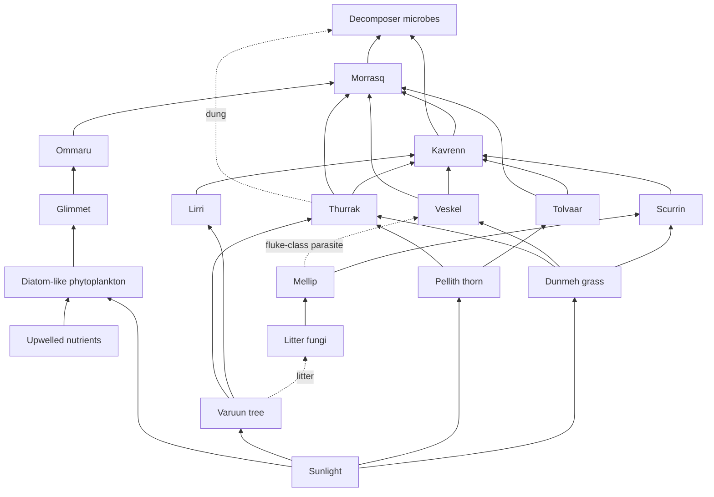

# E-BIOME-001 · World Ecology / Animal Life — first complete biome

Run **WR-SPINE-624** · lane **World Ecology / Animal Life factory** · builds against `THY-IDEA-WORLD-ANIMAL-LIFE-001` and shell `THY-HABITAT-0001` ("Define one habitat before dependent species").
Machine-readable companion: `workrooms/WR-SPINE-624/E-BIOME-001.json`.

**Truth posture of this whole file.** Part 1 restates the brief (backend read 2026-09-28 19:20–19:40 UTC). There was no backend access in this lane, so nothing was re-queried. Everything in Parts 2–4 is **EDEREAIRAH_PROPOSED** (world content) or **PRODUCTION_PLANNED** (products and media), unless a line cites **EDEREAIRAH_CANON** or **EARTH_ACTUAL**. The only world canon used is the **507 Earth-read-day orbit** (`THY-IDEA-TIME-CANON-RESTORE-003`; Hester System, Kaeleenrah V, Orbit 5). No image was generated. No name here is canon: every working name is PROPOSED and needs Chairman lock.

---

## PART 1 · Inventory of animal life in the backend (complete, no sampling)

### 1a. Counts

| Measure | Count | Basis |
|---|---|---|
| Animal-group rows (`thylora_estate_animal_groups`) | 7 | Brief §3 |
| Living-world registry shells (`thylora_living_world_records`, empty) | 10 | Brief §3 |
| Filled living-world records | 1 (THY-PLANT-ROSEMARY-0001, a plant) | Brief §3 |
| Named world creatures | 2 (Skatylorh; Child Guardian Companion Species, which is a category label, not a species name) | Brief §3 |
| Ideas that touch animals | 3 (Canine Detection Lab; Urban Bird + Butterfly Return; Miniworld Civilization + Ecology Reciprocity) | Brief §3 |
| Records with a generic Earth class only (no world name) | 7 (all estate groups) | Brief §3 |
| Records with a headcount | **0** | Every headcount NULL |
| Records with migration, diet, reproduction, lifespan, predators, disease, care staff or population trend | **0** | Brief §3 ("No species with …") |
| Known individual animals | **0** | — |
| Defined habitats | **0** (THY-HABITAT-0001 is an empty shell, habitat NULL) | Brief §3 |

### 1b. Record-by-record table

Key: **U** = UNKNOWN (not in backend). **O** = recorded OPEN in the backend. **—** = not applicable.

| # | Record | Kind | Name status | Count | Habitat | Migration | Diet | Repro cycle | Lifespan | Predators | Diseases | Care personnel | Pop. trend | Truth class |
|---|---|---|---|---|---|---|---|---|---|---|---|---|---|---|
| 1 | HORSE (draught) · ER-CASTLE-ROYAL-001 · 1700s | Estate group | Generic Earth class | NULL | Castle estate (implied) | — | U | U | U; retirement rule O | U | U; vet O | farrier O; vet O | U | as stored (brief gives none) |
| 2 | HORSE (riding) · same | Estate group | Generic Earth class | NULL | same | — | U | U | U; retirement O | U | U; vet O | farrier O; vet O | U | as stored |
| 3 | CATTLE · same | Estate group | Generic Earth class | NULL; **whether kept = O** | same | — | U | U | U | U | U | care cycle O | U | as stored |
| 4 | SHEEP · same | Estate group | Generic Earth class | NULL; whether kept = O | same | — | U | U | U | U | U | care cycle O | U | as stored |
| 5 | PIG · same | Estate group | Generic Earth class | NULL; whether kept = O | same | — | U | U | U | U | U | care cycle O | U | as stored |
| 6 | POULTRY · same | Estate group | Generic Earth class | NULL; whether kept = O | same | — | U | U | U | U | U | care cycle O | U | as stored |
| 7 | WORKING_DOG · same | Estate group | Generic Earth class | NULL; whether kept = O | same | — | U | U | U | U | U | care cycle O | U | as stored |
| 8 | THY-HABITAT-0001 | Registry shell | — | — | **NULL** | — | — | — | — | — | — | — | — | EDEREAIRAH_PROPOSED |
| 9 | THY-WATER-0001 | Registry shell | — | — | NULL | — | — | — | — | — | — | — | — | EDEREAIRAH_PROPOSED |
| 10 | THY-PLANT-0001 | Registry shell | — | U | NULL | — | — | U | U | U | U | U | U | EDEREAIRAH_PROPOSED |
| 11 | THY-BUG-0001 | Registry shell | — | U | NULL | U | U | U | U | U | U | U | U | EDEREAIRAH_PROPOSED |
| 12 | THY-BIRD-0001 | Registry shell | — | U | NULL | U | U | U | U | U | U | U | U | EDEREAIRAH_PROPOSED |
| 13 | THY-ANIMAL-0001 | Registry shell | — | U | NULL | U | U | U | U | U | U | U | U | EDEREAIRAH_PROPOSED |
| 14 | THY-MARINE-0001 | Registry shell | — | U | NULL | U | U | U | U | U | U | U | U | EDEREAIRAH_PROPOSED |
| 15 | THY-WHALE-0001 | Registry shell | — | U | NULL | U | U | U | U | U | U | U | U | EDEREAIRAH_PROPOSED |
| 16 | THY-TREE-0001 | Registry shell | — | U | NULL | — | — | U | U | U | U | U | U | EDEREAIRAH_PROPOSED |
| 17 | THY-LAND-0001 | Registry shell | — | — | NULL | — | — | — | — | — | — | — | — | EDEREAIRAH_PROPOSED |
| 18 | THY-PLANT-ROSEMARY-0001 | Filled plant | Earth name (rosemary) | U | Castle herb garden | — | — | U | U | U | U | U | U | as stored |
| 19 | Skatylorh | Named creature | **World name** | U | U | U | U | U | U | U | U | U | U | Primary shield creature / team-bird on the Peete arms; "No Earth animals" rule on the arms |
| 20 | Child Guardian Companion Species (`THY-IDEA-GUARDIAN-COMPANION-001`) | Creature concept | Category label only | U | U | U | U | U | U | U | U | U | U | Design active; orange furry visual reference; separate from The Jibbit |
| 21 | Canine Detection Lab | Idea | Earth class (dog) | U | U | — | U | U | U | — | U | U | U | idea |
| 22 | Urban Bird + Butterfly Return | Idea | Generic | U | Urban (implied) | U | U | U | U | U | U | U | U | idea |
| 23 | Miniworld Civilization + Ecology Reciprocity | Idea | Generic | U | U | U | U | U | U | U | U | U | U | idea |

### 1c. What is UNKNOWN (complete list for this domain)

1. Planetary gravity, surface pressure, atmosphere composition, water chemistry: **not locked anywhere** (this is the blocker named on `THY-IDEA-WORLD-ANIMAL-LIFE-001`).
2. Native day length, seasons, axial tilt, calendar names: UNKNOWN (recovery active). Only the 507-day orbit is canon.
3. The star's spectral type and brightness, the planet's distance from it, and so the light it gets: UNKNOWN.
4. Any defined habitat: none.
5. Any headcount of any animal: none, including all 7 estate groups.
6. Whether cattle, sheep, pigs, poultry and dogs are kept at ER-CASTLE-ROYAL-001: OPEN.
7. Whether Earth-class livestock exist on EdereAirah at all, given the "No Earth animals" rule on the Peete arms: **unresolved question**. That rule is recorded only for the arms; its reach beyond them is UNKNOWN.
8. Skatylorh's biology (size, habitat, diet, whether it is a real species or heraldic only): UNKNOWN.
9. Guardian Companion Species biology: UNKNOWN beyond the visual reference.
10. Care personnel of any kind for animals (farrier, vet, keeper, warden): none exists.
11. Whether a `LIVING_WORLD_ATLAS` department record exists in the backend: **UNVERIFIED in this lane**. The repo shows it only as a talk-lane key and a panel title in `dashboard-current-head.html`, which this lane does not edit.

---

## PART 2 · One complete biome: the Delta Mosaic (working label `BIOME-DELTA-MOSAIC-A`, fills THY-HABITAT-0001)

### 2a. Choice and why

**Chosen:** a warm **river-delta mosaic** of savanna, floodplain, gallery forest and mangrove, bounded inland by a basalt escarpment and to seaward by a **coastal upwelling shelf**. It is modeled as one connected landscape of 12,000 km² (4,633 mi²) of land plus 6,000 km² (2,317 mi²) of shelf sea.

| Zone | Area (metric) | Area (US) | Role |
|---|---|---|---|
| Open savanna (grass + scattered thorn trees) | 7,000 km² | 2,703 mi² | Grazers, tall browsers, apex predators, soaring scavengers |
| Floodplain / delta grassland | 2,500 km² | 965 mi² | Dry-season refuge; the bottleneck that sets grazer carrying capacity |
| Gallery forest (strips 0.2–0.8 km / 0.12–0.5 mi wide along channels) | 800 km² | 309 mi² | Tall canopy trees, arboreal primate analogue, slug analogue |
| Basalt escarpment and uplands, 400–600 m (1,312–1,969 ft) | 1,500 km² | 579 mi² | Phosphorus- and sodium-rich soils at its foot; cliffs for scavenger nests |
| Mangrove / estuary | 200 km² | 77 mi² | Salt gradient; a hard boundary for freshwater invertebrates and for marine mammals |
| Upwelling shelf (offshore) | 6,000 km² | 2,317 mi² | Swarm crustacean analogue and the filter-feeding marine mammal analogue |

**Justification.** One landscape here holds every class the brief asks for: tall trees (gallery forest), a moist litter layer (slug), a browse layer (tall browser), bulk forage and water (very large herbivore), continuous canopy (primate), large herds (lion-like apex and scavengers), and a nutrient-rich sea (whale-like filter feeder). All of them sit on one food web, and the seasonal pulse of rain and upwelling drives migration. Earth has this combination only in fragments (for example, deltas beside an upwelling coast). Putting it together here is a **world-first** design (`THY-LAW-WORLD-FIRST-EARTH-PARALLEL-001`), not a copy of one Earth place.

### 2b. Time handling (the one canon anchor)

- **CANON:** 1 orbit = **507 Earth-read days** (EDEREAIRAH_CANON).
- **Native day length: UNKNOWN.** This file uses the **Earth SI day (86,400 s)** as a **declared placeholder** (EDEREAIRAH_PROPOSED). Every daily rate (food per day, heat per day) is per Earth-read day. Every seasonal and life-history timing is given as an **orbit fraction** first and in Earth days second (Equation E12). If the native day is locked later, the orbit fractions stay valid. Only the "per day" rates and anything tied to day and night (activity rhythms, the length of a slug's safe night) have to be rescaled.
- **Seasons:** axial tilt is UNKNOWN, so seasonality is modeled as a **rain-and-wind (monsoon-like) cycle** rather than a temperature cycle driven by tilt. It is a PROPOSED assumption, not a claim about the orbit.

| Season (PROPOSED) | Orbit fraction | Earth-read days | What happens |
|---|---|---|---|
| Wet ("long rains") | 0.00–0.42 | 0–213 (213 d) | Savanna greens; herds on the upland-edge plains; synchronized births |
| Early dry | 0.42–0.70 | 213–355 (142 d) | Herds move to the floodplain; upwelling winds start (0.45) |
| Late dry | 0.70–1.00 | 355–507 (152 d) | Forage bottleneck; slugs dormant; upwelling peaks, then ends (0.95) |
| Upwelling season (sea) | 0.45–0.95 | 228–482 (253.5 d) | The marine mammal analogue is present and feeding |

### 2c. Environmental state (every value EDEREAIRAH_PROPOSED unless marked)

| Parameter | Value (metric) | Value (US customary) | Truth class | Rationale |
|---|---|---|---|---|
| Orbit | 507 Earth-read days | same | **EDEREAIRAH_CANON** | THY-IDEA-TIME-CANON-RESTORE-003 |
| Day length | 86,400 s (placeholder) | 24 h | EDEREAIRAH_PROPOSED (placeholder) | Native day UNKNOWN; see 2b |
| Surface gravity g | 9.81 m/s² | 32.17 ft/s² | EDEREAIRAH_PROPOSED (**Earth-baseline placeholder, pending Chairman lock**) | No lock exists. The Earth value keeps human-scale world content (castle, estate) plausible. See the sensitivity table. |
| Sea-level air pressure | 101.3 kPa | 14.69 psi (29.92 inHg) | EDEREAIRAH_PROPOSED (Earth-baseline placeholder) | Consistent with g and the column mass. Sets the oxygen partial pressure. |
| O₂ | 21 % (allowed 19–23 %); pO₂ ≈ 21.3 kPa | pO₂ ≈ 3.09 psi | EDEREAIRAH_PROPOSED | Above ~23 % fire frequency rises sharply and savanna turns to fire grassland. Below ~17 % large-animal aerobic scope drops. |
| N₂ | ≈ 78 % | — (unitless) | EDEREAIRAH_PROPOSED | Balance gas; the biological nitrogen source is microbial fixation |
| Ar + trace | ≈ 0.9 % | — | EDEREAIRAH_PROPOSED | Inert |
| CO₂ | 500 ppm (allowed 400–600) | — | EDEREAIRAH_PROPOSED (**deliberately above Earth pre-industrial**) | Slightly favors C₃ woody plants over C₄ grasses, giving more tree and browse cover than an Earth savanna at the same rainfall. That supports a strong browser guild. |
| H₂O vapor | 1–4 % by volume; relative humidity 35 % (dry-season midday) to 95 % (wet-season night) | — | EDEREAIRAH_PROPOSED | Controls slug activity windows (E10) |
| Temperature, wet season | mean 27 °C; day 30 °C, night 22 °C | mean 80.6 °F; 86 / 71.6 °F | EDEREAIRAH_PROPOSED | Warm and humid |
| Temperature, dry season | day max 34 °C (38 °C extreme), night min 16 °C | 93.2 °F (100.4 °F), 60.8 °F | EDEREAIRAH_PROPOSED | Clear skies give a wide day-night swing and heat stress for large animals (E2) |
| Sea-surface temperature | 17–22 °C in upwelling; 26 °C otherwise | 62.6–71.6 °F; 78.8 °F | EDEREAIRAH_PROPOSED | Cold upwelled water. It also makes a coastal fog strip. |
| Rainfall | savanna 1,100 mm/orbit; floodplain 1,300; uplands 800; coastal fog strip 350 | 43.3; 51.2; 31.5; 13.8 in/orbit | EDEREAIRAH_PROPOSED | About 85 % falls in the wet season (0.00–0.42). A per-orbit basis, not per-Earth-year, avoids a hidden 365-day assumption. |
| Fresh water (rivers, channels) | pH 6.8–7.6; salinity < 0.5 PSU; dissolved O₂ 6–8 mg/L; 24–30 °C | same pH/PSU; DO 6–8 ppm; 75–86 °F | EDEREAIRAH_PROPOSED | Well oxygenated, low salt. Floodplain pools fall to DO 2–4 mg/L late in the dry season. |
| Estuary | 0.5–30 PSU gradient | about 0.07–4.1 oz salt per US gal | EDEREAIRAH_PROPOSED | The osmotic barrier (E11) |
| Sea (shelf) | pH 8.0–8.1; 34–35 PSU; DO 5–7 mg/L at the surface and 2–4 mg/L in upwelled water; nitrate 10–20 µmol/L | about 4.7 oz salt per US gal | EDEREAIRAH_PROPOSED | High nutrients feed high primary production (E9) |
| Soils | Floodplain: clay-rich vertisols (swell and crack), CEC 30–50 cmol/kg. Savanna: sandy loam over laterite, phosphorus-poor. Escarpment foot: basalt-derived, P-rich and Na-bearing. Delta: saline mangrove muds. | — | EDEREAIRAH_PROPOSED | The P and Na gradient sets where herds spend the wet season and why salt licks matter |
| Minerals of note | Salt-lick outcrops (Na) at the escarpment foot and mangrove edge; iron-rich laterite; calcrete in pans | — | EDEREAIRAH_PROPOSED | Needed for herbivore sodium balance and bone mineral |
| Star (light source) | **Assumed G-type (Sun-like), about 5,700–5,800 K**; spectrum peaks near 500 nm | — | EDEREAIRAH_PROPOSED (**the Hester System star type is UNKNOWN**) | This lets chlorophyll-like pigments and green-reflecting leaves work as on Earth. A cooler K or M star would push pigments darker (see sensitivity). |
| Light at the ground | clear-sky noon irradiance ≈ 1,000 W/m²; PAR ≈ 2,000 µmol photons/m²/s; daily light integral 40–50 mol/m²/day (dry) and 25–35 (wet, cloudy) | ≈ 317 BTU/(h·ft²); photon flux has no customary unit | EDEREAIRAH_PROPOSED | Enough to support tall C₃ trees and C₄ grasses |
| Wind | Onshore sea breeze 4–8 m/s; alongshore trade wind (drives upwelling) 6–10 m/s in the dry season | 9–18 mph; 13–22 mph | EDEREAIRAH_PROPOSED | The trade wind drives Ekman offshore transport, which brings deep nutrient water up. It also gives thermals and sea-breeze fronts for soaring. |
| Geology | Passive continental margin; sedimentary delta basin; basalt escarpment 60 km (37 mi) inland | — | EDEREAIRAH_PROPOSED | Makes the low-relief delta, the P-rich escarpment foot and the cliff nest sites |
| Elevation | 0–600 m | 0–1,969 ft | EDEREAIRAH_PROPOSED | The whole mosaic is lowland to low upland |
| Plant material: wood density | Canopy tree 0.72 g/cm³; thorn tree 0.95; range 0.45–0.95 | 44.9 lb/ft³; 59.3 lb/ft³; 28–59 lb/ft³ | EDEREAIRAH_PROPOSED | Dense wood resists browsing damage and fire. Canopy wood trades density for growth speed. |
| Plant material: cell wall | Cellulose 40–45 %, hemicellulose 20–28 %, lignin 20–30 % of dry wood; C₄ grass leaves: lignin 5–8 %, silica 2–5 % | — | EDEREAIRAH_PROPOSED | Silica wears teeth, so grazers need high-crowned teeth. Lignin caps digestibility (feeds into E4). |
| Plant secondary metabolites | Condensed tannins 2–10 % of dry weight in thorn-tree browse (rising to 10–15 % when heavily browsed); alkaloids in some forbs; milky latex in canopy-tree bark | — | EDEREAIRAH_PROPOSED | Browsers need tannin-binding salivary proteins and a varied diet. Latex deters bark-stripping. |

### 2d. Sensitivity notes: what changes if a placeholder changes

| If this changes… | …these derived results move | Direction and size (from this file's equations) |
|---|---|---|
| g up 20 % (11.8 m/s²) | Tall-browser heart pressure (E1); tree maximum height; limb-bone stress (E2); flight wing loading (E14) | E1 gives 204 mmHg instead of 170 at the same neck, so neck and legs shorten. Maximum tree height falls roughly in proportion to 1/g, from about 42 m to about 35 m (138 → 115 ft), which pulls the browse layer, the tall browser's neck and the primate's canopy strata down with it. Large-herbivore maximum mass falls. Soaring gets harder. |
| g down 20 % (7.8 m/s²) | Same equations | E1 gives 136 mmHg, so taller browsers and taller trees become possible. Soaring gets easier. Whale buoyancy is unchanged in ratio (E8 scales with g on both sides). |
| O₂ falls to 17 % | Aerobic scope | Large endurance migrants (Veskel) and pursuit predators suffer first; the migration distance becomes infeasible. |
| O₂ rises to 25 % | Fire | The fire-return interval shortens, gallery forest shrinks, the primate habitat fragments and grass wins. |
| CO₂ at 280 ppm | C₃/C₄ balance | More C₄ grass and fewer trees: more grazers, fewer browsers, lower K for the tall browser. |
| Star cooler (K-type) | PAR, pigment | Plant pigments shift to capture more red and near-infrared, and foliage darkens. The visual spec changes; the trophic structure stays about the same if the total energy is unchanged. |
| Native day length ≠ 24 h | Per-day rates | Daily intake numbers rescale in proportion. Slug night activity windows (E10) rescale. Orbit fractions are unchanged. |
| Dry-season length changes | Carrying capacity (E5) | The dry-season floodplain bottleneck sets grazer K. A dry season 20 % longer cuts K by about 17 %. |
| Upwelling season shorter | E9, whale K | Whale K scales about linearly with upwelling-season primary production. |

---

## PART 3 · Deriving life from the constraints, in trophic order

The rule for every species below: state the **constraint**, then the **body plan it forces**, then **how it differs from the nearest Earth analogue because of this biome's values**. Earth analogues are named only as reference points. None of these is a renamed Earth animal.

### 3.1 Microbes (guild level; no species names proposed)

- **Nitrogen-fixing root symbionts** in thorn trees and floodplain legume-like forbs. Constraint: P-poor savanna soils plus an N₂-rich atmosphere reward fixation where P allows. Result: nitrogen-fixing thorn trees cluster on the escarpment-foot P gradient.
- **Rumen-like fermentation consortia** (cellulose-degrading bacteria, archaea, protists) in grazers and browsers. Constraint: 20–30 % lignin and 40–45 % cellulose mean no vertebrate enzyme can digest the plant bulk, so every large herbivore carries a fermenter (foregut or hindgut).
- **Tannin-tolerant gut microbes** in browsers. They are the reason browse at 2–10 % tannin is usable at all.
- **Sulfate-reducing and methanogenic sediment microbes** in mangrove muds.
- **Marine phytoplankton** (diatom-like, silica-walled). Constraint: nitrate 10–20 µmol/L and silica from upwelling lead to large-celled bloom-formers, which suit a swarm filter-feeder rather than a microbial loop.
- **Decomposer bacteria** on carcasses and dung: the endpoint of the scavenger guild.

### 3.2 Fungi (guild level)

- **Arbuscular mycorrhizae** on grasses and most trees. Constraint: phosphorus-poor laterite soils; fungal hyphae extend root reach for P.
- **Ectomycorrhizae** on the canopy tree (Varuun). Constraint: the tall canopy needs nitrogen and phosphorus from deep litter.
- **Litter and wood decomposers.** Gallery-forest leaf litter at 95 % night humidity is the slug's food base (the slug grazes fungal films on litter).
- **Mound fungus cultivated by termite-like insects**: an invertebrate "fungus garden" that breaks down savanna grass lignin. Generic guild only; no name proposed.

### 3.3 Plants

| Working name (PROPOSED) | Say it | Role | Key constraint → form | Differs from Earth analogue because… |
|---|---|---|---|---|
| **Varuun** | vah-ROON | Gallery-forest emergent canopy tree, 42 m (138 ft) at maturity | Its water column must rise 42 m against gravity (E1 gives 0.41 MPa / 59.8 psi of gravity head alone), so it grows only where roots reach permanent groundwater along channels. It has buttress roots for flood-softened soil and latex bark. | CO₂ at 500 ppm and year-round groundwater let it grow taller than a typical Earth riverine savanna tree, up to Earth rainforest emergent height. It masts (fruits heavily) once every **2 orbits** (1,014 d), not yearly. The 507-day orbit already runs longer than Earth's year, so the fruiting interval for animals is about 2.8 Earth years. |
| **Pellith thorn** | PEL-ith | Flat-crowned savanna browse tree, 7 m (23 ft) | Browsing pressure selects for paired thorns, 10–15 % induced tannin and a flat crown. Dense wood (0.95 g/cm³) resists fire and bark damage. | It has more tree cover per hectare (about 40 trees/ha) than a comparable Earth savanna, because of the CO₂ assumption. Its crown top sits at 5.0–5.5 m, which sets the tall browser's reach (see the Tolvaar entry). |
| **Dunmeh grass** | DUN-meh | Tussock C₄ grass of savanna and floodplain | High light, heat and dry season favor C₄. Grazing selects for 2–5 % silica and growing points at ground level. | Floodplain Dunmeh keeps growing 0.3 kg DM/m² through the dry season on residual soil moisture. That is the dry-season bottleneck resource that sets grazer K (E5). |
| (guild) mangrove analogue | — | Salt-tolerant stilt-rooted trees | Salt-excreting leaves and air roots for anoxic mud | Generic; no name proposed |

**Canopy tree height by age (E13; Chapman–Richards growth, EMPIRICAL_MODEL, parameters PROPOSED)**

| Age (orbits) | Age (Earth days) | Varuun height | Pellith height |
|---|---|---|---|
| 1 | 507 | 0.5 m (2 ft) | 0.3 m (1 ft) |
| 5 | 2,535 | 3.9 m (13 ft) | 1.8 m (6 ft) |
| 10 | 5,070 | 8.6 m (28 ft) | 3.4 m (11 ft) |
| 25 | 12,675 | 20.8 m (68 ft) | 5.9 m (19 ft) |
| 50 | 25,350 | 32.8 m (108 ft) | 6.8 m (22 ft) |
| 100 | 50,700 | 40.4 m (132 ft) | 7.0 m (23 ft) |
| 200 | 101,400 | 42.0 m (138 ft) | 7.0 m (23 ft) |
| 300 (Varuun lifespan) | 152,100 | 42.0 m (138 ft) | — (Pellith lifespan 80 orbits) |

Varuun first fruits at 25–30 orbits (12,675–15,210 d). Pellith first flowers at 8 orbits (4,056 d).

### 3.4 Invertebrates

**Mellip (MEL-ip), the small slug analogue, 3 g (0.11 oz), 3.5 cm (1.4 in).**
- *Moisture constraint.* The body is about 87 % water and has no shell, so the skin is an open evaporating surface. By E10, at 60 % relative humidity it reaches its lethal water loss in about **7.2 h**, and at a dry-season 35 % RH midday in about **3.6 h**. So it is **active only at night in the wet season** (RH above 85 %). For the whole dry season, 0.42–1.00 of the orbit (294 d), it is **dormant** under Varuun buttresses. It seals itself in a dried-mucus epiphragm-like plug and a litter cell.
- *Mucus constraint.* Mucus is 96–98 % water and costs protein and energy. Crawling on mucus is among the most expensive forms of locomotion per distance for its size. So Mellip forages within about 2 m (6.6 ft) of its refuge and grazes fungal films rather than roaming.
- *Osmotic constraint (E11).* Its body fluid is about 120 mOsm/L. Estuary water at around 15 PSU is about 460 mOsm/L, a pull of about **843 kPa (122 psi)** drawing water out of the body. So Mellip is **excluded from the mangrove and delta mouth** and lives only in fresh gallery forest.
- *Differs from Earth slugs:* Earth tropical slugs face seasons of a few months. Mellip's dry-season dormancy is 294 d, about 58 % of its orbit, so it carries a larger mucus-protein reserve and a single reproductive burst at 0.02–0.15 of the orbit. It also serves as the **intermediate host for a fluke-class parasite** that reaches Veskel on the floodplain edge (see the food web).

**Glimmet (GLIM-it), the swarm crustacean analogue, 1.5 g (0.05 oz), 4.5 cm (1.8 in).** Constraint: upwelled diatom blooms are large, patchy particles, so a filter basket of setae on its forelimbs and dense swarms are favored. It moves up at night and down by day to avoid visual predators. *Differs from Earth krill:* its whole feeding season is locked to the 253.5-day upwelling window, and it overwinters in a slowed state on shelf sediments during the non-upwelling 0.95→0.45 window (253.5 d).

**Guilds (no names):** termite-like mound builders (grass decomposition and fungus gardens), dung beetles (dung burial after herds pass), biting flies (vectors of blood protozoa), pollinator bees and moths, carrion flies.

### 3.5 Small animals

**Scurrin (SKUR-in), a burrowing seed-eater, 0.12 kg (0.26 lb), body 14 cm (5.5 in).** Constraint: a 294-day dry season with no green food and ground temperatures up to 34 °C (93 °F) makes a **burrow at 0.5 m (1.6 ft)** a thermal refuge (soil stays at 24–26 °C / 75–79 °F), and makes **seed caching** necessary. *Differs from Earth gerbils and jerboas:* the orbit is longer, so it breeds 3–5 litters only within the wet season, and the population booms and crashes with Dunmeh seed set. It is the main small prey for young Kavrenn and for raptor-class birds (the bird shell THY-BIRD-0001 is still open).

### 3.6 Herbivores

**Veskel (VES-kel), the migratory herd grazer, 180 kg (397 lb), shoulder 1.3 m (4.3 ft).**
- Constraint: silica-rich C₄ grass means high-crowned teeth and a foregut fermenter.
- The P and Na gradient pulls herds to the escarpment-foot short-grass plains in the wet season.
- The dry-season bottleneck (E5) pushes them to the floodplain.
- *Differs from Earth wildebeest:* gestation of 0.50 orbit (253.5 d) followed by lactation of about 0.45 orbit fits **exactly one birth per orbit**, with births synchronized to 0.00–0.08. The migration loop runs about **450 km (280 mi) per orbit**.

**Tolvaar (TOHL-var), the tall browser, 950 kg (2,094 lb), head height 5.0 m (16.4 ft).**
- *Constraint 1: canopy.* Pellith crowns are flat at 5.0–5.5 m. Thurrak strips browse up to about 3.5 m (11.5 ft) with its trunk, so the free browse band is **3.5–5.2 m (11.5–17.1 ft)**, and Tolvaar's head must reach about 5.0 m.
- *Constraint 2: hydrostatic blood pressure (E1).* The pressure needed to lift blood from heart to brain is ΔP = ρgh. A giraffe-style build with the head 3.8 m (12.5 ft) above the heart would need **293.6 mmHg (39.1 kPa, 5.68 psi)** just to overcome gravity, about 384 mmHg at the heart once brain perfusion is added. That is past this file's design threshold of about 300 mmHg. Tolvaar therefore has **longer forelimbs and a sloping back that carry the heart at 2.8 m (9.2 ft)**, with a head-to-heart height of only **2.2 m (7.2 ft)**. E1 gives **170.0 mmHg (22.7 kPa, 3.29 psi)**, so the heart needs about 230 mmHg: high, but within the threshold.
- *Drinking:* with the head lowered 3.0 m (9.8 ft) below the heart, **231.8 mmHg (30.9 kPa, 4.48 psi)** pushes extra pressure into the head. That requires a rete (a net of fine vessels) and check valves in the neck veins, as in giraffes, and Tolvaar drinks with splayed forelegs only at channel banks.
- *Differs from Earth giraffe:* a shorter neck-to-limb ratio (because of the ΔP threshold), heavy salivary tannin-binding proteins (browse at 10–15 % tannin under pressure), and births timed to 0.05–0.20 because gestation is 0.90 orbit (456 d).

**Thurrak (THUR-ak), the very large herbivore, 4,500 kg (9,921 lb), shoulder 3.2 m (10.5 ft).**
- *Square–cube constraint (E2):* scaling a 450 kg ancestor up by 10× in mass gives 2.154× length, 4.642× surface area and 0.464× surface-to-volume ratio. Bone cross-section grows only as L², so the stress on the bone per unit area grows by 2.154×. The result is **columnar legs**, a padded foot and walking only (no gallop).
- *Heat:* resting heat (E3, Kleiber) grows 10^0.75 = 5.623× while skin area grows 4.642×, so **each square meter of skin must shed 1.21× more heat**. In 34–38 °C (93–100 °F) dry-season days the air gives almost no gradient for cooling. Thurrak therefore wallows in channels, **forages at night**, and has **large, thin, blood-vessel-rich ear flaps** plus a sparse bristle coat.
- *Food (E3 + E4):* field metabolic rate ≈ 2 × basal = **321.8 MJ/day (76,900 kcal/day)**. At an energy yield of 6.07 MJ per kg of dry forage, it eats **53.0 kg DM/day (117 lb)**, about 1.18 % of body mass per day.
- *Differs from Earth elephant:* it must reach the escarpment and mangrove salt licks (it is Na-limited on laterite). Its gestation of 1.25 orbits (634 d) plus a 3-orbit birth interval means one calf per 1,521 Earth days. It is also the keystone disturber that keeps gallery-forest gaps open for Pellith and Dunmeh.

### 3.7 Primate analogue

**Lirri (LEER-ee), arboreal fruit and leaf eater, 7 kg (15.4 lb), body 0.55 m (21.7 in), tail 0.7 m (27.6 in).**
- *Canopy structure constraint:* gallery forest is a **linear strip 0.2–0.8 km wide**. The Varuun canopy is continuous at 30–42 m (98–138 ft), with gaps of 2–4 m (6.6–13 ft) at channel bends. That selects for **leaping hindlimbs, grasping hands and feet with opposable first digits, and a balancing tail that can also brake on landing**. Terminal Varuun branches bend under loads above about 8–10 kg (18–22 lb), which caps body mass.
- *Home range:* linear, about 1.5 km × 0.4 km (0.93 × 0.25 mi) = 0.6 km² (0.23 mi²).
- *Social group (E15, HEURISTIC):* how much fruit is ripe per day in a crown, times the number of crowns a group can visit in a day, sets the maximum group before members start competing. Worked through below, it gives **about 14 individuals** (range 12–20). A larger group also detects predators better (there are raptor-class and Kavrenn threats at channel crossings).
- *Differs from Earth monkeys:* Varuun masts only once per **2 orbits**, so Lirri has a **leaf-eating fallback gut** (an enlarged caecum) and gives birth at fruiting peaks (gestation 0.33 orbit, 167 d). The linear forest also forces troops to cross open ground at channel ends, which is the key predation point.

### 3.8 Predators

**Kavrenn (KAV-ren), social apex predator, female 150 kg (331 lb), male 210 kg (463 lb), mean 180 kg (397 lb), shoulder 1.15 m (3.8 ft).**
- *Prey-mass-ratio constraint:* above about 21.5 kg (47 lb), carnivores cannot live on small prey. The energy gained per chase is too low, so they must take prey near or above their own mass (Carbone et al. 1999, EARTH_ACTUAL reference, citation to verify). Veskel at 180 kg (ratio about 1.0 : 1) is the core prey, and taking prey that large on open ground needs **cooperative hunting**, so Kavrenn live in groups ("prides").
- *Food:* FMR ≈ 2.5 × basal ≈ 36 MJ/day. At 7 MJ/kg meat × 0.9 digested, it needs **≈ 5.7 kg meat/day (12.6 lb)** per adult.
- *Territory (E6 + E7):* prey biomass is 2,084 kg/km² (Veskel only; 11,900 lb/mi²). E6 gives 0.2687 Kavrenn per 10,000 kg of prey, so density = 0.0560/km² (0.145/mi²). **A pride of 10 needs about 179 km² (69 mi²).**
- *Differs from Earth lions:* Veskel leave the savanna for the floodplain for **294 d each orbit**, so resident territories are not viable year-round. Prides are **semi-nomadic**, following herds to the floodplain edge, with a wet-season core range and a dry-season shared corridor. They have a leaner, longer-legged build than an Earth lion for the added travel. Cubs are born 0.05–0.25, timed to the Veskel calving flush.

### 3.9 Scavengers

**Morrasq (mor-ASK), soaring carrion eater, 7.5 kg (16.5 lb), wingspan 2.5 m (8.2 ft), wing area about 1.0 m² (10.8 ft²).**
- *Constraint:* carcasses are scattered and unpredictable, so the bird must search huge areas at almost no flight cost. That means **soaring on thermals** over hot dry-season savanna and on **sea-breeze fronts** along the coast. Wing loading (E14) = **73.6 N/m² (1.54 lbf/ft²)**: low enough to circle in thermals climbing about 1 m/s (200 ft/min).
- It has a bare head (hygiene inside carcasses) and a highly acidic stomach (it kills carcass pathogens). It nests on escarpment cliffs.
- *Differs from Earth vultures:* it **follows the Veskel migration** over about 450 km per orbit, and it uses the **coastal fog-strip updrafts** in the upwelling season to scavenge stranded marine carcasses. That makes it the link between sea and land in the food web.

### 3.10 Marine mammal analogue

**Ommaru (oh-MAH-roo), a baleen-type filter feeder, 25,000 kg (55,116 lb), length 14 m (45.9 ft).**
- *Buoyancy constraint (E8):* at a body density of about 1,027 kg/m³ in 1,025 kg/m³ seawater, its net weight is only **−49 kgf (−108 lbf)** for a 25-tonne body. The water carries the weight, so **there is no skeletal support limit on size**. The limits become food supply, heat and gape mechanics.
- *Freshwater hazard:* at 1,012 kg/m³ (the estuary) its net weight is −365 kgf (−805 lbf), and in fresh water −657 kgf (−1,448 lbf). Together with osmotic stress (E11), this keeps Ommaru **out of the delta mouth**. Stranding in the estuary is a real mortality source, and it is the Morrasq's marine link.
- *Food requirement (E3 + E4):* basal 582 MJ/day. Its field rate ≈ 2.5 × basal = **1,456 MJ/day**. Per orbit that is 1,456 × 507 = 738,200 MJ. Glimmet at 4.0 MJ/kg wet × 0.85 assimilated gives **217 t (478,600 lb) of Glimmet per orbit**, all eaten in the 253.5-day upwelling window: **≈ 856 kg/day (1,887 lb)**, about 3.4 % of body mass per feeding day. It lives off blubber the rest of the orbit.
- *Upwelling supply (E9):* shelf primary production of 800 g C/m²/yr × a 10 % transfer to Glimmet gives 1,111 t wet per km² per orbit. Over 6,000 km² that is **6.67 million t per orbit**. If Ommaru may take 5 %, **K ≈ 1,536**.
- *Differs from Earth whales:* its feeding season is set by the **253.5-day** upwelling window instead of polar summer. Its calving grounds are **UNKNOWN** (off-map). Its gestation of 0.72 orbit (365 d) makes calving fall in the non-upwelling window.

---

## PART 4 · Products of the biome

### 4a. Species dossiers (12 animals and plants; all EDEREAIRAH_PROPOSED)

Orbit fraction × 507 = Earth-read days (E12). Diseases are **generic classes only**. Their presence is modeled, not observed, and there is no medical detail. Population numbers are **model estimates with no census behind them**.

| Field | **Varuun** (vah-ROON) | **Pellith** (PEL-ith) | **Mellip** (MEL-ip) | **Glimmet** (GLIM-it) |
|---|---|---|---|---|
| Role | Canopy emergent tree | Savanna browse tree | Small slug analogue | Swarm crustacean analogue |
| Size | 42 m (138 ft); ≈15,000 kg (33,069 lb) above-ground | 7 m (23 ft); ≈900 kg (1,984 lb) | 3.5 cm (1.4 in); 3 g (0.11 oz) | 4.5 cm (1.8 in); 1.5 g (0.05 oz) |
| Diet / energy | Photosynthesis (C₃) | Photosynthesis (C₃), N-fixing | Fungal films on litter | Diatom-like phytoplankton |
| Reproduction | Mast every 2 orbits (1,014 d); first fruit at 25–30 orbits | Flowers 0.35–0.45 (177–228 d into orbit); first at 8 orbits | Hermaphrodite; eggs at 0.02–0.15; hatch 0.04 orbit (20 d) | Spawns 0.50–0.80; larvae in the upwelling plume |
| Lifespan | 300 orbits (152,100 d) | 80 orbits (40,560 d) | 1.2 orbits (608 d) | 2 orbits (1,014 d) |
| Predators / consumers | Lirri (fruit, leaves); wood-boring insects | Tolvaar, Thurrak, Veskel (seedlings) | Scurrin (opportunistic), ground birds (OPEN), Lirri (rarely) | Ommaru, fish guild (OPEN), seabird guild (OPEN) |
| Diseases / parasites (classes) | Heart-rot fungi; bark beetles | Galling insects | Lungworm-class nematodes; fluke-class trematodes (intermediate host) | Ciliate epibionts; microsporidian-class |
| Migration | — | — | None (dormant 294 d) | Vertical, day and night |
| Population estimate | ≈1.6 M trees (20/ha × 800 km² gallery forest) | ≈28 M trees (40/ha × 7,000 km²) | ~10⁹ (5/m² wet season × 50 % of 800 km²) | ~2 × 10¹² (standing stock 3.3 Mt at production/biomass ratio 2) |
| Carrying-capacity basis | Area × stem density (HEURISTIC) | Area × stem density | Area × litter density | E9 production ÷ P/B |
| Trend | UNKNOWN (no baseline) | UNKNOWN | UNKNOWN | UNKNOWN |

| Field | **Scurrin** (SKUR-in) | **Veskel** (VES-kel) | **Tolvaar** (TOHL-var) | **Thurrak** (THUR-ak) |
|---|---|---|---|---|
| Role | Burrowing seed-eater | Migratory herd grazer | Tall browser | Very large herbivore |
| Size | 14 cm (5.5 in); 0.12 kg (0.26 lb) | 1.3 m (4.3 ft) shoulder; 180 kg (397 lb) | head 5.0 m (16.4 ft); 950 kg (2,094 lb) | 3.2 m (10.5 ft) shoulder; 4,500 kg (9,921 lb) |
| Diet | Dunmeh seed, insects | Dunmeh grass; 3.45 kg DM/day (7.6 lb) | Pellith browse; 11.0 kg DM/day (24.3 lb) | Mixed grass, browse, bark; 53.0 kg DM/day (117 lb) |
| Trophic level | 2 | 2 | 2 | 2 |
| Reproduction | Gestation 0.05 orbit (25 d); litters of 4–6; 3–5 litters in the wet season | Gestation 0.50 (253.5 d); 1 calf per orbit; births 0.00–0.08 | Gestation 0.90 (456 d); birth interval 1.5 orbits (760 d) | Gestation 1.25 (634 d); birth interval 3 orbits (1,521 d) |
| Lifespan | 1.5 orbits (761 d) | 14 orbits (7,098 d) | 18 orbits (9,126 d) | 45 orbits (22,815 d) |
| Predators | Young Kavrenn, raptor guild (OPEN), snake guild (OPEN) | Kavrenn | Kavrenn (calves only) | None on adults; Kavrenn on calves (rare) |
| Diseases / parasites | Flea-class ectoparasites; plague-like bacterial class (boom years) | Fluke-class (via Mellip); tick-class; blood protozoa (fly-borne); soil-spore bacterial class (late dry season) | Tick-class; blood protozoa; oxpecker-analogue cleaning (OPEN) | Gut nematodes; skin fungal class; tusk/limb injury |
| Migration | None | ≈450 km (280 mi) loop per orbit: upland-edge plains in the wet season, floodplain in the dry season | Local; drifts to channel banks in the dry season | Seasonal, 30–80 km (19–50 mi): savanna in the wet season, river and salt licks in the dry season |
| Population estimate | ~5 M mean (boom ~14 M) | **≈110,000** (0.75 K) | **≈1,200** (0.7 K) | **≈3,500** (0.73 K) |
| Carrying capacity K and basis | ~2,000/km² at boom × 7,000 km² (seed-crop HEURISTIC) | E5: dry-season floodplain gives **K ≈ 147,900** (wet-season K ≈ 250,100; the dry season binds) | E5: 2.0 t/km²/yr browse in the band, u = 0.5, gives **K ≈ 1,742** | E5: 450 t/km²/yr, u = 0.25, share 8 %, over 10,300 km², gives **K ≈ 4,789** |
| Trend | UNKNOWN | UNKNOWN; model assumes stable | UNKNOWN | UNKNOWN |

| Field | **Lirri** (LEER-ee) | **Kavrenn** (KAV-ren) | **Morrasq** (mor-ASK) | **Ommaru** (oh-MAH-roo) |
|---|---|---|---|---|
| Role | Primate analogue | Social apex predator | Soaring scavenger | Filter-feeding marine mammal analogue |
| Size | 0.55 m (21.7 in) body; 7 kg (15.4 lb) | 1.15 m (3.8 ft) shoulder; 150–210 kg (331–463 lb) | 2.5 m (8.2 ft) wingspan; 7.5 kg (16.5 lb) | 14 m (45.9 ft); 25,000 kg (55,116 lb) |
| Diet | Varuun fruit, with leaves as fallback; about 0.5 kg fruit/day (1.1 lb) | Veskel; 5.7 kg meat/day (12.6 lb) | Carrion; about 0.5 kg/day averaged (1.1 lb) | Glimmet; 856 kg/day (1,887 lb) in the feeding season |
| Trophic level | 2 (2.2 with insects) | 3 | 3 (scavenger) | 3 |
| Reproduction | Gestation 0.33 (167 d); single infant; birth interval 1 orbit | Gestation 0.22 (111.5 d); litters of 2–4; births 0.05–0.25 | 1 egg per orbit; incubation 0.11 (56 d); fledging 0.25 (127 d) | Gestation 0.72 (365 d); birth interval 2 orbits (1,014 d) |
| Lifespan | 16 orbits (8,112 d) | 11 orbits (5,577 d) | 22 orbits (11,154 d) | 55 orbits (27,885 d) |
| Predators | Kavrenn (at channel crossings); raptor guild (OPEN) | None on adults; Kavrenn infanticide | None on adults; egg predators (OPEN) | Pack-hunting marine predator guild (OPEN) on calves |
| Diseases / parasites | Gut nematodes; malaria-like blood protozoa class (mosquito-borne) | Tick-class; feline-distemper-like viral class; mange mites | Few (acidic gut); lead-free (no human hunting modeled) | Morbillivirus-class; barnacle-analogue epibionts; whale-louse-analogue |
| Migration | None | Semi-nomadic, following Veskel | Follows Veskel; coastal in the upwelling season | Arrives at 0.45 and leaves at 0.95; calving grounds UNKNOWN |
| Population estimate | **≈8,000** | **≈420** (0.79 K) | **≈1,500** | **≈1,000** |
| K and basis | E15: groups of about 14 per 0.6 km² at 50 % occupancy of 800 km², **K ≈ 9,300** | E6: 0.0560/km² × 9,500 km², **K ≈ 532** | Carrion 1,205 t/orbit × 40 % share ÷ 253.5 kg per bird per orbit, **K ≈ 1,901** | E9: 5 % of 6.67 Mt ÷ 217 t, **K ≈ 1,536** |
| Trend | UNKNOWN | UNKNOWN | UNKNOWN | UNKNOWN |

Morrasq carrion basis: Veskel deaths 27,500 per orbit (25 % turnover of 110,000) × 120 kg × 30 % reaching scavengers = 990 t; Thurrak 78 deaths × 3,000 kg × 80 % = 187 t; Tolvaar 67 deaths × 700 kg × 60 % = 28 t. Total ≈ **1,205 t (2.66 M lb) per orbit**.

### 4b. Life-history timelines (one orbit; 0.00 = start of the wet season)

```
Orbit fraction  0.0    0.1    0.2    0.3    0.4    0.5    0.6    0.7    0.8    0.9    1.0
Earth-read day  0      51     101    152    203    254    304    355    406    456    507
Season          |==== WET (0.00-0.42) ====|---- EARLY DRY ----|------ LATE DRY -------|
Upwelling (sea)                              |=========== 0.45-0.95 ============|
Veskel          [births 0.00-0.08] upland plains -> migrate (0.40) -> floodplain -> return (0.95)
                mating 0.50-0.58 --------- gestation 253.5 d -------------------> births
Tolvaar         [births 0.05-0.20] (0.90-orbit gestation; each female every ~1.5 orbits)
Thurrak         savanna ------------------------> rivers + salt licks ----------> savanna
Kavrenn         [cubs 0.05-0.25] wet-season core range --> follows herds to floodplain edge
Lirri           births at Varuun fruiting peaks (mast years only; every 2 orbits)
Mellip          [active nights, eggs 0.02-0.15] ------|  DORMANT 0.42-1.00 (294 d)  |
Scurrin         [3-5 litters 0.05-0.40] ------------- seed caches, burrow ----------
Morrasq         [egg 0.30, hatch 0.41, fledge 0.66]  -> follows migration / coast
Ommaru                                       [arrive 0.45 ... feed 856 kg/d ... leave 0.95]
Glimmet                                      [bloom-feeding, spawn 0.50-0.80]  (slowed state rest)
```

### 4c. Migration map (text spec; visual law: spec only, no image)

- **Frame:** a north-up schematic of 12,000 km² of land plus 6,000 km² of shelf. The coast runs along the west edge. The delta fans out at the center-west. The escarpment is a north–south line 60 km (37 mi) inland on the east. Gallery forest is drawn as green ribbons along 3 main channels.
- **Layer 1, Veskel loop (≈450 km / 280 mi per orbit):** a clockwise arrow from the escarpment-foot short-grass plains (east; wet season) south-west across the savanna to the floodplain (center-west; dry season 0.42–0.95), then north-east back. Label the departure at 0.40 and the return at 0.95.
- **Layer 2, Kavrenn:** hatched wet-season core ranges of about 179 km² (69 mi²) each on the savanna, with a shared dry-season corridor along the floodplain edge.
- **Layer 3, Thurrak:** short two-way arrows between the savanna and the channels, with salt-lick icons at the escarpment foot and the mangrove edge.
- **Layer 4, Morrasq:** cliff-nest icons on the escarpment; a dashed line shadowing the Veskel loop; a coastal fog-strip soaring band (0.45–0.95).
- **Layer 5, Ommaru:** an offshore band over the upwelling shelf with arrival and departure arrows off the map edge labeled "calving grounds UNKNOWN". A red hatched **estuary exclusion / stranding risk** zone.
- **Layer 6, fixed residents:** Lirri (gallery ribbons), Mellip (gallery forest only; red "salt barrier" line at the estuary), Scurrin (savanna stipple).
- **Every unknown visual field (colors, texture, icon art, typography):** UNKNOWN; the visual design lane sets them.

### 4d. Food web



The Kavrenn edge on Thurrak is calves only (rare), and on Tolvaar it is calves mostly. The dotted Mellip edge to Veskel is **parasite transmission** (Veskel eats Mellip by accident on the forage), not predation.

### 4e. Population table (model estimates only; no census exists)

| Species | Area basis | K (model) | Estimate (PROPOSED) | Density | Trend |
|---|---|---|---|---|---|
| Varuun | 800 km² / 309 mi² | — | 1.6 M | 2,000/km² (5,180/mi²) | UNKNOWN |
| Pellith | 7,000 km² / 2,703 mi² | — | 28 M | 4,000/km² | UNKNOWN |
| Mellip | 400 km² occupied | — | ~10⁹ | ~5/m² (wet season) | UNKNOWN |
| Glimmet | 6,000 km² shelf | — | ~2 × 10¹² | — | UNKNOWN |
| Scurrin | 7,000 km² | ~14 M (boom) | ~5 M mean | 700/km² mean | Boom-bust (modeled); observed UNKNOWN |
| Veskel | 9,500 km² / 3,668 mi² | 147,900 | 110,000 | 11.6/km² (30/mi²) | UNKNOWN |
| Tolvaar | 7,000 km² | 1,742 | 1,200 | 0.17/km² (0.44/mi²) | UNKNOWN |
| Thurrak | 10,300 km² / 3,977 mi² | 4,789 | 3,500 | 0.34/km² (0.88/mi²) | UNKNOWN |
| Lirri | 800 km² | 9,300 | 8,000 | 10/km² | UNKNOWN |
| Kavrenn | 9,500 km² | 532 | 420 | 0.044/km² (0.11/mi²) | UNKNOWN |
| Morrasq | whole landscape | 1,901 | 1,500 | 0.125/km² | UNKNOWN |
| Ommaru | 6,000 km² shelf | 1,536 | 1,000 | 0.17/km² (upwelling season) | UNKNOWN |

### 4f. Equations (Math Display Law). IDs are PROPOSED: `MATH-BIOME-<n>-624`. Existing `MATH-SHARED-VISION-622` is referenced and not redefined.

Each block gives: symbols and units · domain and scale · threshold · assumptions · failure condition · plain meaning · child meaning · worked example · class.

**E1 · Hydrostatic pressure: ΔP = ρ · g · h** (`MATH-BIOME-01-624`)
- Symbols: ΔP = pressure difference, Pa (psi; also mmHg); ρ = fluid density, kg/m³ (lb/ft³); g = gravitational acceleration, m/s² (ft/s²); h = vertical height of the fluid column, m (ft). Operators: multiplication.
- Domain and scale: static or slow-moving liquid columns, 0–100 m (0–328 ft); blood ρ ≈ 1,050 kg/m³ (65.5 lb/ft³), water 1,000 kg/m³ (62.4 lb/ft³).
- Threshold: this file's design limit for heart-to-brain gravity load is about 300 mmHg (40 kPa, 5.8 psi) total heart pressure, anchored on EARTH_ACTUAL giraffe heart pressures of roughly 200–300 mmHg (citation to verify).
- Assumptions: the fluid is still (flow losses ignored); ρ is constant; g is the PROPOSED 9.81 m/s².
- Failure condition: it does not apply to fast pulsatile flow (dynamic pressure adds to it). For plant xylem, it covers the gravity term only; friction and transpiration pull are extra.
- Plain meaning: the taller the liquid column, the harder a pump must push to lift liquid to the top.
- Child meaning: "Pushing juice up a very tall straw is hard work. A taller straw is harder still."
- Worked example: Tolvaar with h = 2.2 m: ΔP = 1,050 × 9.81 × 2.2 = 22,661 Pa = **22.7 kPa = 170.0 mmHg = 3.29 psi**. A giraffe-style h = 3.8 m gives 39.1 kPa = 293.6 mmHg = 5.68 psi, which fails the threshold. For the Varuun water column at h = 42 m: 1,000 × 9.81 × 42 = 412 kPa = 59.8 psi.
- Class: **PHYSICAL_LAW**.

**E2 · Square–cube scaling: A ∝ L², V ∝ L³, so A/V ∝ L⁻¹** (`MATH-BIOME-02-624`)
- Symbols: L = a characteristic length, m (ft); A = surface or cross-section area, m² (ft²); V = volume, m³ (ft³); mass M = ρV, kg (lb); "∝" means "grows in proportion to".
- Domain and scale: shapes scaled up or down without changing proportions (isometric scaling); 0.001–100,000 kg.
- Threshold: bone stress σ ∝ M/A ∝ L. Across Earth mammals, peak bone stress is held near a fixed safety factor, so above about 1,000 kg columnar legs become necessary (EARTH_ACTUAL, citation to verify).
- Assumptions: shape stays the same; tissue density stays the same.
- Failure condition: real animals do not scale isometrically (legs thicken faster than length), so this is an upper-bound estimate of stress.
- Plain meaning: make an animal 10× heavier and its skin and bone cross-sections grow only about 4.6×, so each square meter carries more weight and must shed more heat.
- Child meaning: "A big ice cube melts slower than lots of little ones, because it has less outside for its inside."
- Worked example: 450 kg → 4,500 kg (10× mass): L × 2.154, A × 4.642, A/V × 0.464. Combined with E3, heat per unit of skin rises 5.623 / 4.642 = **1.21×**.
- Class: **ENGINEERING_CONSTRAINT** (a geometric consequence; the bone-stress threshold is empirical).

**E3 · Kleiber metabolic scaling: B = a · M^0.75** (`MATH-BIOME-03-624`)
- Symbols: B = basal metabolic rate, kcal/day (also MJ/day and W); a = 70 kcal·day⁻¹·kg^−0.75 (≈ 3.39 W·kg^−0.75); M = body mass, kg (lb); the exponent 0.75 has no units.
- Domain and scale: endotherms (warm-blooded animals) of about 0.01–100,000 kg.
- Threshold: none built in. This file uses field metabolic rate ≈ 2 × B for herbivores and 2.5 × B for predators and the marine mammal (EMPIRICAL_MODEL multipliers, PROPOSED).
- Assumptions: Earth-like vertebrate cell physiology, 21 % O₂, core temperature about 37 °C (98.6 °F).
- Failure condition: it fits ectotherms (slug, crustacean) and very small endotherms poorly. The exponent is debated (0.67–0.75), and a native biochemistry could have different coefficients.
- Plain meaning: bigger animals burn more energy in total but less per kilogram.
- Child meaning: "A big animal eats more food than a small one, but not as much more as its size would make you guess."
- Worked example: Thurrak M = 4,500 kg: 4,500^0.75 = 549.4, so B = 70 × 549.4 = **38,460 kcal/day = 160.9 MJ/day = 1,862 W**. Ommaru 25,000 kg: **582.3 MJ/day**.
- Class: **EMPIRICAL_MODEL**.

**E4 · Intake from energy balance: I = FMR / (GE · d · q)** (`MATH-BIOME-04-624`)
- Symbols: I = dry-matter food intake, kg/day (lb/day); FMR = field metabolic rate, MJ/day; GE = gross energy of food, MJ/kg DM (18.5 for plants); d = digestible fraction (unitless); q = metabolizable fraction of digested energy (≈ 0.82, unitless). For meat and Glimmet, GE·d·q is replaced by the energy density × assimilation.
- Domain and scale: daily intake of adult animals at steady body mass.
- Threshold: gut capacity. The intake cannot exceed about 2–3 % of body mass per day for large herbivores (EARTH_ACTUAL range, citation to verify). Food with d < 0.4 fails for Thurrak.
- Assumptions: body mass is steady; no stored fat is being used (except Ommaru, which is computed per orbit).
- Failure condition: during fattening, lactation or starvation, intake departs from maintenance.
- Plain meaning: food needed = energy used ÷ usable energy per kilogram of food.
- Child meaning: "If your food has less energy in it, you need to eat more of it."
- Worked example: Thurrak: 321.8 / (18.5 × 0.40 × 0.82 = 6.07) = **53.0 kg DM/day (117 lb)**. Veskel: 28.8 / 8.34 = 3.45 kg (7.6 lb). Tolvaar: 100.2 / 9.10 = 11.0 kg (24.3 lb). Ommaru: 738,200 MJ per orbit / (4.0 × 0.85) = 217 t per orbit, which over 253.5 d = 856 kg/day (1,887 lb).
- Class: **ENGINEERING_CONSTRAINT** (conservation of energy) with **EMPIRICAL_MODEL** coefficients.

**E5 · Forage carrying capacity: K = (A · P · u · s) / (I · T)** (`MATH-BIOME-05-624`)
- Symbols: K = maximum sustainable number of animals (count); A = area, km² (mi²); P = forage production over the limiting period, kg DM/km² (lb/mi²); u = proper-use fraction (unitless; how much can be eaten without degrading the range); s = the species' share of the usable forage (unitless); I = intake per animal, kg DM/day; T = length of the limiting period, days.
- Domain and scale: herbivores with food as the binding limit; landscape scale (10²–10⁵ km²).
- Threshold: the binding K is the **minimum** over seasons.
- Assumptions: u = 0.25–0.5 and the s shares are PROPOSED. Predation and disease are not included (they hold numbers below K).
- Failure condition: if water, minerals (Na) or predators bind first, the true K is lower.
- Plain meaning: count the food, divide by what one animal eats, and use the hungriest season.
- Child meaning: "The number of animals a place can feed depends on how much food grows there in the hungriest time."
- Worked example: Veskel dry season: A = 2,500 km², P = 300 t/km² over 294 d, u = 0.4, s = 0.5, giving 150,000 t. Divided by (3.45 kg/day × 294 d = 1.014 t) that is **K ≈ 147,900**. The wet-season K ≈ 250,100, so the dry season binds.
- Class: **HEURISTIC**.

**E6 · Carnivore density from prey biomass: N_c = c · M_c^−1.16 × (B_p / 10,000)** (`MATH-BIOME-06-624`)
- Symbols: N_c = carnivore density, animals/km² (/mi²); c = 111 (the fitted constant for animals per 10,000 kg of prey); M_c = carnivore body mass, kg; B_p = prey biomass density, kg/km² (lb/mi²).
- Domain and scale: mammalian carnivores of 1–300 kg (EARTH_ACTUAL fit, Carbone & Gittleman 2002, citation to verify).
- Threshold: at prey biomass below about 500 kg/km², a social apex predator cannot hold a territory in this model.
- Assumptions: an Earth-like fit carries over to world carnivores (PROPOSED).
- Failure condition: persecution, disease or competitors like hyena-class animals change the outcome. Scatter around the fit is about 2× either way.
- Plain meaning: more prey supports more hunters; bigger hunters are fewer.
- Child meaning: "The more zebra-sized snacks there are, the more big cats can live nearby."
- Worked example: M_c = 180 kg gives 111 × 180^−1.16 = 0.2687 per 10,000 kg. With B_p = 110,000 × 180 / 9,500 = 2,084 kg/km², N_c = 0.2687 × 0.2084 = **0.0560/km² (0.145/mi²)**, so K = 0.0560 × 9,500 = **532**.
- Class: **EMPIRICAL_MODEL**.

**E7 · Group territory: A_t = G / N_c** (`MATH-BIOME-07-624`)
- Symbols: A_t = territory area, km² (mi²); G = group size (count); N_c = density from E6, per km².
- Domain and scale: territorial social predators.
- Threshold: if A_t is larger than the area the pride can patrol (about 400 km² / 154 mi² for this build), territoriality breaks down and the prides become nomadic.
- Assumptions: territories do not overlap.
- Failure condition: migratory prey (as here) make territories seasonal.
- Plain meaning: the hunting land a group needs = group size ÷ how many hunters the land can feed per square kilometer.
- Child meaning: "A bigger family needs a bigger backyard to find dinner."
- Worked example: G = 10 gives 10 / 0.0560 = **179 km² (69 mi²)** in the wet season. In the dry season prey leave (B_p drops about 70 %), which gives about 600 km², over the 400 km² threshold, so the prides become semi-nomadic, as modeled.
- Class: **HEURISTIC**.

**E8 · Archimedes net buoyancy: F_net = (ρ_w − ρ_b) · V · g** (`MATH-BIOME-08-624`)
- Symbols: F_net = net upward force, N (lbf); ρ_w = water density, kg/m³; ρ_b = body density, kg/m³; V = body volume, m³ (ft³); g = m/s².
- Domain and scale: fully submerged bodies.
- Threshold: F_net close to 0 means neutral buoyancy, and the skeleton need not carry the weight.
- Assumptions: body density 1,027 kg/m³ (PROPOSED); lung volume changes are ignored.
- Failure condition: it does not apply when the animal is partly out of the water (stranding: the skeleton must suddenly carry the full weight, which crushes the chest and is lethal).
- Plain meaning: water pushes up with a force equal to the weight of the water the body pushes aside.
- Child meaning: "In the bath you feel lighter because the water holds you up."
- Worked example: V = 25,000 / 1,027 = 24.3 m³ (859 ft³). In seawater at 1,025: (1,025 − 1,027) × 24.3 × 9.81 = **−478 N (−107 lbf, about 49 kgf)**. In the estuary at 1,012: −3,582 N. In fresh water: −6,448 N (−1,450 lbf).
- Class: **PHYSICAL_LAW**.

**E9 · Trophic transfer: P_n = P_1 · TE^(n−1)** (`MATH-BIOME-09-624`)
- Symbols: P_n = production at trophic level n, g C/m²/yr (and in wet t/km² per orbit); P_1 = primary production; TE = transfer efficiency (unitless, 0.05–0.20); n = trophic level.
- Domain and scale: whole ecosystems.
- Threshold: at TE < 0.05, whale-scale filter feeders cannot be sustained in this model.
- Assumptions: P_1 = 800 g C/m²/yr (upwelling, PROPOSED); TE = 0.10; wet mass = 10 × carbon mass.
- Failure condition: food chains are webs, not chains, and a strong microbial loop lowers the effective TE.
- Plain meaning: each step up the food chain keeps only about a tenth of the energy.
- Child meaning: "When a fish eats a shrimp, most of the shrimp's energy gets used up, so big eaters need lots of small food."
- Worked example: 800 × 0.10 = 80 g C/m²/yr for Glimmet, which is 800 g wet/m²/yr = 800 t/km²/yr, or × 507/365 = **1,111 t/km² per orbit**. Over 6,000 km² that is **6.67 Mt**, and 5 % ÷ 217 t = **K ≈ 1,536 Ommaru**.
- Class: **EMPIRICAL_MODEL**.

**E10 · Desiccation survival time: t = f · W / (E · A_s)** (`MATH-BIOME-10-624`)
- Symbols: t = time to lethal water loss, h; f = tolerable fraction of body water lost (unitless, 0.5); W = body water, g (oz); E = evaporation rate per area, g/cm²/h (oz/in²/h); A_s = wet skin area, cm² (in²).
- Domain and scale: small shell-less invertebrates in still air.
- Threshold: if t is shorter than the foraging bout plus the return trip, foraging is not possible.
- Assumptions: E = 0.030 g/cm²/h at 60 % RH and 0.060 at 35 % RH, 25–30 °C (PROPOSED, order-of-magnitude).
- Failure condition: wind, sun and mucus-film behavior change E by a factor of 2–5.
- Plain meaning: a slug can stay out only until it has lost about half its water.
- Child meaning: "A slug is like a wet sponge: in dry air it dries out, so it only comes out when it's damp."
- Worked example: W = 2.6 g, f = 0.5, A_s = 6 cm² (0.93 in²). At 60 % RH: 1.3 / (0.030 × 6) = **7.2 h**. At 35 % RH: **3.6 h**. At night in the wet season (RH above 85 %), E is very small and t runs past the whole night.
- Class: **HEURISTIC**.

**E11 · Van 't Hoff osmotic pressure: π = C · R · T** (`MATH-BIOME-11-624`)
- Symbols: π = osmotic pressure, Pa (psi); C = osmolar concentration, mol/m³ (mOsm/L numerically equals mol/m³); R = 8.314 J/(mol·K); T = absolute temperature, K (°F is converted through K).
- Domain and scale: dilute solutions, below about 1,000 mOsm.
- Threshold: a concentration gradient of about 200 mOsm is beyond what a freshwater slug can pump against.
- Assumptions: ideal solution; T = 298 K (25 °C / 77 °F).
- Failure condition: it overestimates π for concentrated seawater because real solutions are not ideal.
- Plain meaning: salty water pulls water out of a less-salty body with a force set by the salt difference.
- Child meaning: "Salt makes a slug dry out, like salt on a cucumber."
- Worked example: slug fluid 120 mOsm gives 297 kPa (43.1 psi); estuary 460 mOsm gives 1,140 kPa. The difference is **843 kPa (122 psi)**, so the barrier holds.
- Class: **PHYSICAL_LAW** (dilute limit).

**E12 · Orbit-fraction conversion: t_d = φ × 507** (`MATH-BIOME-12-624`)
- Symbols: t_d = Earth-read days; φ = orbit fraction (unitless, 0–1 or larger for multi-orbit spans); 507 = CANON Earth-read days per orbit.
- Domain and scale: all world timings.
- Threshold: none.
- Assumptions: the 507-day orbit is canon; the native day is UNKNOWN, so no conversion to native days is attempted.
- Failure condition: if "Earth-read day" is redefined, the constant changes.
- Plain meaning: a fraction of the year times the year length gives days.
- Child meaning: "Half a world-year is about 253 Earth days."
- Worked example: Veskel gestation φ = 0.50 gives **253.5 d**. Thurrak φ = 1.25 gives **633.75 d**.
- Class: **FORMAL_SYSTEM_LAW** (a definition).

**E13 · Chapman–Richards height growth: H(t) = H_max · (1 − e^(−k·t))^c** (`MATH-BIOME-13-624`)
- Symbols: H = height, m (ft); H_max = asymptotic maximum height, m (ft); k = growth rate, per orbit; t = age, orbits; c = shape exponent (unitless); e = Euler's number.
- Domain and scale: single-species trees, from seedling to old age.
- Threshold: H_max must stay below the E1 hydraulic limit for the given g and water supply.
- Assumptions: Varuun H_max = 42 m, k = 0.035, c = 1.3; Pellith 7 m, 0.08, 1.2 (PROPOSED).
- Failure condition: browsing, fire or flood damage break the curve (Pellith under heavy Thurrak browsing is held at about 3 m).
- Plain meaning: trees grow fast when young, then slow as they approach their top height.
- Child meaning: "Trees shoot up when they're young and then take it slow, like kids who stop growing when they're grown."
- Worked example: Varuun at t = 25 orbits: 42 × (1 − e^−0.875)^1.3 = 42 × (0.583)^1.3 = **20.8 m (68 ft)**.
- Class: **EMPIRICAL_MODEL**.

**E14 · Wing loading: W_L = m · g / S** (`MATH-BIOME-14-624`)
- Symbols: W_L = wing loading, N/m² (lbf/ft²); m = mass, kg (lb); g = m/s²; S = wing area, m² (ft²).
- Domain and scale: flying animals of 0.01–20 kg.
- Threshold: soaring birds that rely on thermals are at about 60–100 N/m² (EARTH_ACTUAL range, citation to verify).
- Assumptions: S = 1.0 m² (PROPOSED).
- Failure condition: it ignores wing shape (aspect ratio), which also governs how fast a glider sinks.
- Plain meaning: weight per unit of wing; lower means it can circle in weaker rising air.
- Child meaning: "Big wings and a light body let a bird float on warm air without flapping."
- Worked example: 7.5 × 9.81 / 1.0 = **73.6 N/m² (1.54 lbf/ft²)**.
- Class: **PHYSICAL_LAW** (as a definition) used as an **ENGINEERING_CONSTRAINT**.

**E15 · Fruit-patch group-size ceiling: G_max = (n_p · Y · h) / q** (`MATH-BIOME-15-624`)
- Symbols: G_max = maximum group size before members compete (count); n_p = crowns visited per day (count); Y = ripe fruit per crown per day, kg (lb); h = harvestable fraction (unitless); q = per-capita need, kg/day (lb/day).
- Domain and scale: fruit-eating primates feeding in patches.
- Threshold: if predation risk requires a larger group than G_max, the group splits and rejoins (fission–fusion).
- Assumptions: n_p = 3, Y = 4 kg, h = 0.6, q = 0.5 kg (PROPOSED). Lirri FMR ≈ 2 × 1.26 = 2.52 MJ/day, with fruit at about 5 MJ/kg fresh.
- Failure condition: in non-mast orbits Lirri switch to leaves and G_max rises, because leaves are less contested.
- Plain meaning: a group can only be as big as the fruit it finds each day can feed.
- Child meaning: "If there are only 14 cookies a day, only about 14 friends can share without fighting."
- Worked example: 3 × 4 × 0.6 / 0.5 = **14.4, so about 14**.
- Class: **HEURISTIC**.

**Equation count: 15.** By class:
- PHYSICAL_LAW (4): E1, E8, E11, E14
- ENGINEERING_CONSTRAINT (2): E2, E4 (E4's coefficients are empirical)
- EMPIRICAL_MODEL (4): E3, E6, E9, E13
- FORMAL_SYSTEM_LAW (1): E12
- HEURISTIC (4): E5, E7, E10, E15

No organizational model is labeled a physical law.

### 4g. Care and conservation: who cares for them (roles only, under the `LIVING_WORLD_ATLAS` department; **no new department**)

Names are **OPEN**. Any new person name must first pass `THY-LAW-NAME-FREQUENCY-001` ("Marcus" is retired). Existing people are not reassigned without Chairman approval. That the department exists as a backend record is UNVERIFIED (see 1c #11).

| Proposed role | Scope | Bridges to |
|---|---|---|
| Biome Custodian: Delta Mosaic | Owns BIOME-DELTA-MOSAIC-A parameters and the sensitivity table; carries the Chairman lock request | THY-HABITAT-0001 |
| Species Dossier Keeper | Keeps the 12 dossiers; runs the name-lock and pronunciation review | THY-ANIMAL/PLANT/TREE/BUG/MARINE/WHALE shells |
| Population & Census Lead | Owns K models; defines what an "observed" count means in-world | E5–E7, E9 |
| Migration Corridor Warden | Veskel loop, Kavrenn corridor, Thurrak salt licks | 4c map |
| Marine Mammal Stewardship Lead | Ommaru, estuary stranding response, upwelling monitoring | THY-WHALE-0001, THY-MARINE-0001 |
| Wildlife Health Liaison (world) and **Earth Veterinary Review Liaison** | World: disease classes only. Earth: routes any Earth pet-care or medical claim to a licensed veterinarian (DVM) before publication | 4k; THY-LAW-HELP-PRIVILEGE-SAFETY-001 |
| Estate Animal Husbandry Liaison | Links this atlas to the 7 ER-CASTLE-ROYAL-001 groups (farrier and vet OPEN) without inventing headcounts | thylora_estate_animal_groups |
| Children's Learning Editor | Six-readability pass (`THY-LAW-SIX-READABILITY-001`) on the child-meaning lines and the lessons | 4i |

### 4h. Media and video concepts (PRODUCTION_PLANNED; visual spec only, no images)

1. **"One Orbit on the Delta"**: a 12-segment long-form piece, one segment per 0.083 of the orbit, following a Veskel herd's 450 km loop with Kavrenn, Morrasq and the Ommaru arrival as cross-cuts. The hook is that a year is 507 days, so the migration has room the Earth one does not.
2. **"The Straw Problem"**: a short explainer on E1 using the Tolvaar vs a giraffe-style neck: a clear-tube demonstration spec, and a computed 170 vs 294 mmHg on-screen card. Earth-parallel segment: real giraffe physiology (sourced).
3. **"Why the Slug Sleeps"**: a mini-doc on Mellip: E10 humidity windows, the E11 salt barrier and 294 d dormancy. Earth-parallel: garden slug care and why salt harms them (sourced).

### 4i. Children's learning (3 lessons; EDUCATION; the child-meaning lines above are the core text)

1. **Tall Neck, Strong Heart** (ages 7–10): E1 by using a straw at different heights. Outcome: "Taller means harder to pump."
2. **Who Eats Whom on the Delta** (ages 5–8): build the 4d food web with cards, then remove Glimmet and watch Ommaru and Morrasq go hungry. Outcome: understanding food webs and energy loss (E9).
3. **Seasons in a Long Year** (ages 8–11): a paper orbit wheel divided into 507 days, placing births, migration and slug dormancy on it (E12). Outcome: fractions and calendars.

### 4j. Store / product derivatives (PRODUCTION_PLANNED; **no prices**; nothing is created on Shopify in this run)

| Candidate product | Shelf (existing) | Spec | Blocker |
|---|---|---|---|
| **Delta Mosaic Field Guide** (12 species, both units, pronunciations) | LEARNING_EDU / RELEASE_WORLD_EXPANSION | 48–64 pp; dossiers 4a; equations shown in child form plus an appendix | Chairman lock on names and biome parameters |
| **Plush spec: Lirri** (first plush candidate; cute, arboreal, safe silhouette) | PRODUCTS_DESIGN | Body 0.55 : tail 0.7 proportion kept; grasping hands; tail with a wired curl. Colors, fabric and face: UNKNOWN (visual lane). Toy-safety standard review required (ASTM F963 / EN 71 via Product & Regulatory Safety, Caleb Ishikawa's lane). | Visual spec; safety review |
| **Coloring book: One Orbit on the Delta** | LEARNING_EDU | 24 line-art pages following the 4b timeline | Line-art is specification only (no images this run) |
| **Poster: Delta Food Web** | PRODUCTS_DESIGN | The 4d graph rendered with icons; both-unit sidebar | Visual lane |
| Price | — | **Candidate only, UNSET** | APPROVAL_REQUIRED (Chairman), via Stripe/Shopify lanes per the locked provider authority |

### 4k. Earth pet-care derivative (EARTH_PROPOSED; Earth parallel after the world version)

**Concept: "Growing Older Together: A Senior Pet Care Starter Guide" (dogs and cats), shelf FRESHPATH_HOUSEHOLD or LEARNING_EDU.**
- Grounding (Earth veterinary basics to be sourced from the AAHA Senior Care Guidelines for Dogs and Cats (2023) and the AAFP Feline Senior Care Guidelines (2021). **Citations to verify before use**; HOLD_FOR_EVIDENCE on exact wording):
  - Regular veterinary check-ups, commonly advised more often for seniors (for example, every 6 months).
  - Tracking body weight and body condition at home.
  - Dental care.
  - Watching for changes in mobility, appetite, drinking and urination, sleep or behavior, and confusion, and reporting them to a veterinarian rather than self-treating.
  - Home adjustments: non-slip floors, ramps, easy-access litter box, warm bedding.
  - Enrichment and gentle exercise suited to the animal.
- **Rule:** every medical or health claim (signs, conditions, diet, supplements, medication, dosing, euthanasia or end-of-life content) **must be reviewed and approved by a licensed veterinarian (DVM) before publication**. The guide gives **no doses and no diagnoses**, and every page carries "Ask your veterinarian." That review is owned by the Earth Veterinary Review Liaison (4g) together with Caleb Ishikawa (Product & Regulatory Safety) and Elena Marrow (consumer protection).
- World link: the E3 teaching point ("smaller animals burn more energy per kilogram") explains why feeding amounts are set per pet by a vet, not by a body-weight rule alone.
- Estate link: an Earth history companion on working-animal retirement in the 1700s needs sourced history (brief §4 law 7); the ER-CASTLE-ROYAL-001 retirement rule stays OPEN.

### 4l. 15-way source scan (applied to this biome)

1. **HELP:** it fills the named blocker on THY-IDEA-WORLD-ANIMAL-LIFE-001 with a lockable parameter set plus a pet-care help guide.
2. **STORY:** the Veskel loop and the Ommaru arrival give a natural 1-orbit narrative spine.
3. **PRODUCT:** field guide, Lirri plush, coloring book, food-web poster (no prices).
4. **SERVICE:** species dossier lookup; a "what lives here" atlas service for other world lanes.
5. **EDUCATION:** 3 lessons; 15 equations each with a child meaning.
6. **PARTICIPATION:** readers propose Skatylorh's habitat and fill open guilds (raptor, fish, seabird) through a submission form (spec later).
7. **SOFTWARE:** the JSON companion is ready to load into `thylora_living_world_records`, and K models can run as a calculator.
8. **MEDIA:** the 3 video concepts in 4h.
9. **LICENSING:** species names and designs are licensable only after Chairman lock plus an IP check (Priya Nwosu, IP & Media Rights).
10. **DISTRIBUTION:** LEARNING_EDU and PRODUCTS_DESIGN shelves; school packets.
11. **REVENUE:** candidate only, from the product derivatives; no figures exist.
12. **REINVESTMENT:** a proposed routing of any proceeds to real Earth wildlife or pet-welfare help; APPROVAL_REQUIRED.
13. **ARCHIVE:** register the MATH-BIOME-01..15-624 equations and the THY-HABITAT-0001 fill via the production director.
14. **EARTH APPLICATION:** the senior pet-care guide; real physics lessons (ΔP, buoyancy, square–cube).
15. **EDEREAIRAH APPLICATION:** the first defined habitat, species and food web, plus the template for every later biome.

---

## Top blockers for Chairman lock

1. **Planetary gravity, pressure, atmosphere, water chemistry**: all Earth-baseline placeholders (g = 9.81 m/s², 101.3 kPa, 21 % O₂). Every E1, E2, E8 and E14 result depends on them.
2. **Star type and irradiance**: assumed G-type; the Hester System star is UNKNOWN.
3. **Native day length and axial tilt**: all per-day rates depend on the Earth SI day placeholder, and seasons are assumed to be driven by rain rather than tilt.
4. **Species working names** (13 new names). The collision check in this repo found 0 matches; the backend-wide `THY-LAW-NAME-FREQUENCY-001` run is not done.
5. **Whether Earth-class livestock (the 7 estate groups) are allowed on EdereAirah**, given the "No Earth animals" arms rule.
6. **Whether the `LIVING_WORLD_ATLAS` department exists in the backend** before roles are proposed into it.

## Status table

| Item | State |
|---|---|
| Part 1 inventory (23 records, counts, unknowns) | DONE (from the brief; no re-query possible) |
| Part 2 biome parameters + sensitivity | DONE as PROPOSED; lock BLOCKED on the Chairman |
| Part 3 derivation (microbes → marine) | DONE (guild level for microbes, fungi, most insects) |
| Part 4 dossiers (12), timelines, map spec, food web, population table | DONE as PROPOSED |
| 15 equations under the Math Display Law | DONE; Earth-reference coefficients are "citation to verify" |
| Care roles | PARTIAL: roles only; names OPEN; department record UNVERIFIED |
| Media, lessons, store, pet-care concepts | DONE as concepts; the pet guide is BLOCKED on DVM review |
| JSON companion | DONE (validated with `node JSON.parse`) |
| Open guilds (raptor, fish, seabird, snake, marine predator, medium grazers other than Veskel) | OPEN, not derived |
| Skatylorh biology | UNKNOWN (not invented) |

## Next executable work

| Work | Class | Owner (proposed) | Blocker | Release condition | Next executable action |
|---|---|---|---|---|---|
| Lock g, P, O₂/CO₂, water chemistry, star type | APPROVAL_REQUIRED | Chairman; Biome Custodian | No lock exists | Chairman accepts or amends table 2c | Present table 2c and the sensitivity table 2d to the Chairman |
| Write THY-HABITAT-0001 + 12 species + MATH-BIOME-01..15-624 to the backend | QUEUED_WITH_DEPENDENCY | Production director | Parameter lock; name lock | Items 1 and 3 approved | Load E-BIOME-001.json through the director's central write |
| Name-frequency run on the 13 names | NOW (for the director) | Species Dossier Keeper | Backend access (none in this lane) | — | Run THY-LAW-NAME-FREQUENCY-001 on Varuun … Ommaru |
| Verify Earth-reference citations (Kleiber; Carbone 1999; Carbone & Gittleman 2002; giraffe BP; AAHA 2023; AAFP 2021) | HOLD_FOR_EVIDENCE | Research lane | Sources not fetched in this lane | Primary source located and quoted | Fetch and quote each source |
| Derive the open guilds (raptor, fish, seabird, snake, second grazer) | QUEUED_WITH_DEPENDENCY | Species Dossier Keeper | Parameter lock | Lock done | Re-run Part 3 for these guilds |
| Senior pet-care guide draft | APPROVAL_REQUIRED | Earth Veterinary Review Liaison | DVM review | A licensed vet signs off | Draft an outline with no medical claims, then send it for DVM review |
| Confirm the LIVING_WORLD_ATLAS department row | HOLD_FOR_EVIDENCE | Production director | No backend access here | Row found or created by the Chairman | Query the department table |

## Restart point

A cold reader starts from `E-BIOME-001.json`, which holds the PROPOSED Delta Mosaic parameters (Earth-baseline placeholders for g, pressure and atmosphere; the CANON 507-day orbit; the Earth SI day as a declared placeholder), the 12 species with masses, diets, lifespans in Earth-read days, K-model estimates and constraint lists, the food-web edges and the unknowns. The derivation logic and all 15 equations with worked examples are in Parts 3 and 4f of this file. Nothing has been written to the backend. The next step is the Chairman's decision on table 2c. If g, pressure, O₂ or star type change, re-run E1, E2, E8, E13 and E14 first (see 2d), then E5–E7 and E9 for the population numbers, then update the dossiers.
