# I · Network Fabric — layered architecture for THYLORA / EdereAirah

Run **WR-SPINE-624** · Lane **I** (Internet / Social / Bank / Market / Crypto architecture) · Systems architecture desk
Builds on: `THY-IDEA-PLANETARY-NETWORK-FABRIC-001` (map Earth failure modes by layer, then design EdereAirah
equivalents and adapter boundaries one layer at a time), `THY-IDEA-INTERNAL-PROTOCOL-LANGUAGE-001` (semantic type
system + signed adapter contract, no reliance on obscurity), `THY-IDEA-SUCCESSION-RECOVERY-PROTOCOL-001`.
Consistent with: `docs/RAE-LINK-ARCHITECTURE.md` (one backend `thylora-dash`, Postgres + RLS, rules written twice —
JS for immediacy, SQL for enforcement) and `rae-link/lib/providers.js` (capability → provider, ≥ 2 alternates, exit cost).

**Truth class of this whole document: PRODUCTION_PLANNED (architecture) / EDEREAIRAH_PROPOSED (world-native
equivalents).** Nothing here is canon. Nothing here was written to the backend, to git, or to any provider.

---

## 0 · Position in one paragraph

This is not "build our own Internet." THYLORA cannot and should not replace Earth's physical networks, DNS root,
certificate authorities, card networks or banking rails. What it can own is **the meaning layer above them**: its
own identities, its own signed records, its own ledger of record, its own archive, and a thin, replaceable adapter
around every Earth service. The design rule is: *Earth infrastructure is a transport and a settlement venue, never
the source of truth.* If an Earth provider disappears, THYLORA loses reach for a while; it must not lose memory,
identity, money records or rights evidence.

---

## 1 · Layered diagram

```mermaid
flowchart TB
  subgraph LOCAL["L18 Offline / local survivability (device + household node)"]
    DEV["Device keystore (Ed25519 per device, passkey)"]
    LCACHE["Local signed event log + read pack"]
  end

  subgraph TRUST["Trust spine"]
    L1["L1 Identity"]
    L13["L13 Security (keys, revocation, capabilities)"]
    L14["L14 Audit (hash-chained, append-only)"]
    L12["L12 Rights / provenance"]
  end

  subgraph MEANING["Meaning layers (THYLORA-owned, one backend: thylora-dash)"]
    L2["L2 Communications"]
    L3["L3 Knowledge / library"]
    L4["L4 Search"]
    L5["L5 Social"]
    L16["L16 Media (RAE Link)"]
    L15["L15 Archive"]
  end

  subgraph VALUE["Value layers"]
    L6["L6 Commerce"]
    L7["L7 Payments"]
    L8["L8 Ledger (single-writer, double-entry)"]
    L9["L9 Banking (world-layer only)"]
    L10["L10 Markets (world-layer only)"]
    L11["L11 Digital assets (world-layer only; Earth-facing = APPROVAL_REQUIRED)"]
  end

  subgraph EARTH["L17 Earth adapters (anti-corruption layer, quotas, breakers, kill-switch)"]
    A_SB["Supabase (Postgres/Auth)"]
    A_VC["Vercel (hosting)"]
    A_GH["GitHub (source, dashboard authority)"]
    A_DNS["DNS registrar + TLS CA"]
    A_SH["Shopify (storefront)"]
    A_ST["Stripe (Earth payments, LOCKED)"]
    A_LS["Lemon Squeezy (test only)"]
    A_EM["Email (provider OPEN)"]
    A_AS["App stores (OPEN)"]
  end

  DEV --> L1
  LCACHE <-->|"sync later: append-only, CRDT or LWW per type; money never CRDT"| MEANING
  L1 --> L13 --> L14
  L12 --> L16
  MEANING --> L14
  VALUE --> L8
  L8 --> L14
  L7 -->|"adapter"| A_ST
  L6 -->|"adapter"| A_SH
  MEANING -->|"adapter"| A_SB
  MEANING -->|"adapter"| A_VC
  L2 -->|"adapter"| A_EM
  L15 -->|"mirror"| A_GH
  TRUST -->|"adapter"| A_DNS
```

---

## 2 · The internal protocol language (THY-IDEA-INTERNAL-PROTOCOL-LANGUAGE-001) — PROPOSED

Every record that crosses a layer boundary travels in one **signed envelope**. Security comes from keys and
signatures, never from secret formats (Kerckhoffs' principle): the envelope schema is public.

| Field | Meaning |
|---|---|
| `type` | Semantic type URN, e.g. `thy:ledger.entry/1`, `thy:social.post/1`, `thy:rights.grant/1`. Versioned; unknown types are stored, never executed. |
| `truth_class` | One of the `thy_truth_class` enum (EARTH_ACTUAL … QUARANTINED). Required. A `WORLD_*` value may never be routed to an Earth payment adapter. |
| `author` | Identity ID (L1) + device key ID that signed. |
| `seq` | Per-device monotonic counter (detects gaps and replays). |
| `prev` | SHA-256 of the author's previous envelope (per-device hash chain). |
| `content_hash` | SHA-256 of the canonical payload (content addressing, Git-style). |
| `payload` | Canonical JSON (sorted keys, UTF-8, no floats for money — integer minor units). |
| `caps` | Capability token IDs that authorised the action (L13). |
| `sig` | Ed25519 signature over `type‖truth_class‖author‖seq‖prev‖content_hash`. |

**Signed adapter contract:** each Earth adapter declares, in a signed manifest: capability name, semantic types it
may emit/consume, schema translation map, quota, breaker thresholds, kill-switch owner, and the ≥ 2 alternates already
listed in `providers.js`. An adapter that emits a type not in its manifest is rejected at the boundary.

---

## 3 · The eighteen layers

Format per layer: **Purpose · EdereAirah-native design (PROPOSED) · Earth dependency today · Failure mode · Adapter
boundary · What stays local.** "Today" names only what the repo or production brief evidences; anything not evidenced
is marked UNKNOWN.

### L1 · THYLORA identity
- **Purpose:** one person (or house, department, world inhabitant) = one identity across app, RAE Link, store, dashboard.
- **Native design:** identity = a root identity record + a set of **per-device Ed25519 keys** enrolled under it; login
  by **passkey (WebAuthn)**; the identity ID is THYLORA-issued, not the provider's user ID. Earth persons and
  EdereAirah inhabitants are different identity classes (mirrors RAE Link channel classes; a world inhabitant never
  authenticates as an Earth person).
- **Earth dependency today:** Supabase Auth (`identity_auth: supabase-auth`, ACTIVE); one browser session key
  `thylora_app_auth_session`; email for sign-in/recovery (email provider OPEN).
- **Failure mode:** Supabase Auth outage or account suspension → nobody can sign in; provider user IDs leak into
  every table → exit becomes a rebuild; email loss → recovery path dead.
- **Adapter boundary:** `identity_auth` adapter maps provider user ID ↔ THYLORA identity ID in one mapping table;
  no other table references the provider ID. Alternates: WorkOS, Clerk, self-hosted OIDC (already listed).
- **Stays local:** device private keys (never leave the device's secure enclave / platform authenticator), a cached
  signed identity document, the last valid capability set.

### L2 · Communications
- **Purpose:** messages between members, departments, Chairman; notifications.
- **Native design:** messages are signed envelopes in rooms (Matrix-like room model, but on one backend, not a
  federation); end-to-end encryption for private rooms is **HOLD_FOR_EVIDENCE** (needs key-backup design first).
- **Earth dependency today:** Supabase Postgres (storage + realtime); email provider OPEN (Resend/Postmark/SES
  candidates); web push PLANNED; APNs/FCM only via app stores (OPEN).
- **Failure mode:** email deliverability loss; push provider revokes; realtime channel down → messages appear lost.
- **Adapter boundary:** `email_notification`, `push_notification` adapters receive only *notification stubs*
  ("you have a message"), never message bodies — the body stays in THYLORA storage.
- **Stays local:** outbox of signed, unsent messages; read history already fetched.

### L3 · Knowledge / library
- **Purpose:** canon, laws, idea registry, legal library (Samira Vale's Civic Archive Quarter domain), help content.
- **Native design:** every document is content-addressed (SHA-256), versioned (never overwrite, as RAE Link's
  `version_no`/`replaces_asset_id`), carries a truth class; canon changes require a signed approval envelope.
- **Earth dependency today:** Supabase Postgres (`idea_registry`, `continuity_log`, math registry); GitHub (this repo,
  docs/); Vercel (public-site static pages).
- **Failure mode:** silent edit of canon; loss of provenance ("who changed the orbit to 507?"); single copy in one region
  (ca-central-1).
- **Adapter boundary:** exports as signed bundles (hash manifest + files) to the archive (L15); GitHub is a mirror, not
  the authority.
- **Stays local:** an **offline read pack** — the current canon, laws and help pages as a signed static bundle.

### L4 · Search
- **Purpose:** find documents, media, products, people (public profiles only).
- **Native design:** search index is always *derived* and rebuildable from records; never holds unique data.
  Truth class is a filter facet so world-simulated content is never ranked as Earth fact.
- **Earth dependency today:** Postgres FTS (`search: postgres-fts`, ACTIVE; `rael_search`).
- **Failure mode:** index drift from source; index becomes a shadow database.
- **Adapter boundary:** `search` capability; alternates Typesense / Meilisearch / OpenSearch. Rebuild job is the test.
- **Stays local:** a small local index over the offline read pack (client-side, e.g. a prebuilt JSON inverted index).

### L5 · Social layer
- **Purpose:** follows, posts, reactions, residency participation, creator channels.
- **Native design:** posts are signed envelopes; reactions/follows are **CRDT sets** (add/remove-wins with tombstones);
  moderation decisions are signed by a moderator identity and stored with policy version (as RAE Link already does).
  Federation with outside networks (ActivityPub) is an *adapter*, not the core.
- **Earth dependency today:** Supabase; RAE Link tables (written, **not applied** per architecture doc).
- **Failure mode:** spam/Sybil accounts; moderation outage; child safety (family stories) — BRIEF law 8.
- **Adapter boundary:** optional `activitypub_bridge` adapter (OPEN, HOLD_FOR_EVIDENCE) that translates outbound
  public posts only; inbound federated content lands QUARANTINED until moderated.
- **Stays local:** drafts, own posts, follow list.

### L6 · Commerce
- **Purpose:** catalogue (28 `products`, 13 shelves), cart, orders, fulfilment, digital downloads.
- **Native design:** THYLORA owns the catalogue and order record; storefronts render it. An order is an envelope that
  *requests* a payment; it is not itself money.
- **Earth dependency today:** Shopify = storefront lane (LOCKED); `products`, `prices`, `orders` in Supabase; downloads 0.
- **Failure mode:** catalogue forks between Shopify and backend; storefront outage; Shopify account hold.
- **Adapter boundary:** `payments_physical`/storefront adapter syncs *from* backend *to* Shopify (one direction for
  catalogue), and *from* Shopify *to* backend for order events (webhook → verified → translated). Nothing is created or
  priced on Shopify in this run.
- **Stays local:** catalogue read pack; cart; order intents queued offline (never auto-charged on reconnect without re-confirmation).

### L7 · Payments
- **Purpose:** move Earth money in and out.
- **Native design:** THYLORA never holds card data (processor tokenisation only). Payment state machine:
  `INTENT → AUTHORISED → CAPTURED → SETTLED | REFUNDED | DISPUTED`, each transition a signed envelope with the
  processor reference as evidence.
- **Earth dependency today:** **Stripe = Earth payment provider (LOCKED)**; Shopify Payments witness ($1.99 founding
  Chairman purchase); Lemon Squeezy $1.00 TEST. **Drift found:** `rae-link/lib/providers.js` still lists
  `payments_digital: active 'lemonsqueezy'` (PLANNED) with Stripe as an alternate — inconsistent with the LOCKED authority.
- **Failure mode:** processor outage; account freeze; webhook spoofing; double-capture on retry.
- **Adapter boundary:** idempotency key per intent; webhook signature verified at the adapter; circuit breaker; the
  adapter writes only to a *staging* table that the ledger (L8) consumes.
- **Stays local:** nothing that moves money. Offline = payments unavailable, by design.

### L8 · Ledger
- **Purpose:** the single record of who is owed what, in integer minor units.
- **Native design:** **single-writer, double-entry, append-only** ledger. Every transaction = balanced set of postings
  (Σ debits = Σ credits, §8.3). Corrections are reversing entries, never updates or deletes. Reconciled daily against
  processor settlement reports.
- **Earth dependency today:** Supabase Postgres. RAE Link has `rael_ledger_entries` (integer minor units, basis points,
  SQL↔JS parity) — **not yet applied**. **Design findings before it is applied:** (a) it is an allocation table, not a
  double-entry ledger (no balancing debit side); (b) `revenue_event_id … on delete cascade` would let deleting a revenue
  event erase money records — should be `on delete restrict` with reversal entries.
- **Failure mode:** two writers → double-spend/split-brain; floating-point rounding; retroactive edits.
- **Adapter boundary:** processors feed evidence in; the ledger never calls out. Only one service role may post.
- **Stays local:** a read-only signed statement snapshot. **Money is never CRDT and never written offline.**

### L9 · Banking
- **Purpose (world-layer):** EdereAirah institutions that hold and lend world value (existing OPEN shells, no names).
- **Native design:** **simulation / world-layer only.** World "accounts" are ledger sub-accounts in a separate
  `WORLD_*` currency code that cannot be converted to Earth currency by any adapter.
- **Earth dependency today:** none for world banking. Earth banking = Stripe payouts to the operator's bank (not
  modelled here); creator payouts OPEN (`stripe-connect`, `wise`, `tipalti`, manual).
- **Failure mode:** users read world balances as real money → consumer-protection and money-transmission exposure.
- **Adapter boundary:** there is **no** adapter from world banking to Earth rails. Earth-facing deposit, lending or
  stored value = money transmission / banking activity → **APPROVAL_REQUIRED** (licensed partner + legal review).
- **Stays local:** world balances readable offline from the snapshot.

### L10 · Markets
- **Purpose (world-layer):** EdereAirah exchange for the 6 `thylora_world_market_companies` (all
  `REGISTERED_PRIVATE_NO_LISTING`, no share capital, no shares).
- **Native design:** simulation order book with world currency only; every screen labelled "world simulation".
- **Earth dependency today:** none.
- **Failure mode:** anything resembling an offer of Earth securities (profit expectation from others' efforts) triggers
  securities law.
- **Adapter boundary:** none to Earth brokers/exchanges. Any Earth-facing listing, share, token sale or revenue-share
  offer = **APPROVAL_REQUIRED** (securities counsel).
- **Stays local:** read-only market history.

### L11 · Digital assets
- **Purpose (world-layer):** world items, collectibles, credentials, licences.
- **Native design:** assets are signed envelopes with a content hash and an owner identity in THYLORA's own ledger —
  no public blockchain required. Transfer = double-entry posting of an asset unit.
- **Earth dependency today:** none.
- **Failure mode:** a transferable, cash-redeemable world asset becomes a regulated virtual currency or security.
- **Adapter boundary:** **any Earth-facing digital asset (on-chain token, redeemable credit, resale market) must pass
  legal review — APPROVAL_REQUIRED.** Default: non-transferable outside THYLORA, not redeemable for Earth money.
- **Stays local:** owned-asset list and their signed certificates (verifiable offline).

### L12 · Rights / provenance
- **Purpose:** who may publish what; licences; likeness; family/child safeguards.
- **Native design:** rights grants are signed envelopes; media carries its rights envelope hash; RAE Link's rule
  "rights before upload" is kept. Provenance chain: capture → edit → publish, each step hashed (C2PA-style manifests
  are an adapter option, HOLD_FOR_EVIDENCE).
- **Earth dependency today:** Supabase (`rael_rights_records`, not applied).
- **Failure mode:** unlicensed media published; grant revoked but media still live; forged provenance.
- **Adapter boundary:** outbound publication adapters must present a valid rights envelope hash; revocation propagates as
  a takedown event.
- **Stays local:** own rights grants and their signatures.

### L13 · Security
- **Purpose:** keys, capabilities, revocation, secrets.
- **Native design:** **capability-based authorisation layered on Postgres RLS.** A capability = signed, scoped,
  short-lived token (subject, action, resource pattern, expiry, issuer). RLS enforces *access*; capability + role +
  signed approval enforce *authority*. **Access is not authority:** being able to read a row never permits acting on
  it; the service role can write, but a write that changes canon, money or rights also needs the right signed envelope.
- **Earth dependency today:** Supabase RLS + service keys; provider credentials in backend secrets (per providers.js);
  TLS via Vercel-managed certificates (issuing CA not verified here — UNKNOWN).
- **Failure mode:** leaked service key; over-broad RLS; stale revoked device still trusted.
- **Adapter boundary:** secrets live only in adapter runtime; adapters receive scoped capabilities, never the root.
- **Stays local:** device key, cached revocation list with its issue time.

### L14 · Audit
- **Purpose:** prove what happened, in order, by whom.
- **Native design:** append-only **hash-chained** event log (each row stores SHA-256 of previous row), periodically
  **anchored**: the chain head is signed and published to ≥ 2 independent places (GitHub mirror + archive; public
  timestamp service optional). Pattern already present: per the production brief the backend hash-chains
  `chairman_source_messages` — generalise that, do not reinvent it.
- **Earth dependency today:** Supabase (`continuity_log`, `chairman_source_messages`).
- **Failure mode:** privileged actor rewrites history and recomputes the chain → defeated only by external anchoring.
- **Adapter boundary:** anchor publisher adapter (write-only, head hash + signature, no content).
- **Stays local:** each device's own signed chain; last known anchored head.

### L15 · Archive
- **Purpose:** long-term, immutable copies of canon, records, media originals, ledger.
- **Native design:** content-addressed object store (hash = name), manifests signed, **3-2-1** (§10). Originals always
  retained (as RAE Link keeps mezzanine files).
- **Earth dependency today:** Supabase (single region ca-central-1); GitHub (source/docs); `backups` capability **OPEN**
  (`provider-pitr`, `scheduled-dump-to-cold-storage`).
- **Failure mode:** no second copy; backups that were never restored; ransomware on the only copy.
- **Adapter boundary:** `object_storage` (OPEN: S3 / R2 / GCS / B2 / Supabase Storage) written via encrypted,
  hash-verified uploads; object-lock / immutability where the provider supports it.
- **Stays local:** an encrypted offline copy (the "1" in 3-2-1) held by a custodian, never on a public host.

### L16 · Media
- **Purpose:** RAE Link — upload, transcode, publish, play, earn.
- **Native design:** as `docs/RAE-LINK-ARCHITECTURE.md` (pipeline, channel classes, world-simulated disclosure).
- **Earth dependency today:** Vercel (surface), Supabase; object storage, transcode, CDN, captions, moderation all OPEN.
- **Failure mode:** CDN/transcoder lock-in; loss of originals; world-simulated media shown without disclosure.
- **Adapter boundary:** already capability-addressed; add quotas and breakers (§9).
- **Stays local:** downloaded renditions with their signed manifest.

### L17 · Earth adapters
- **Purpose:** the only place Earth vendors are touched.
- **Native design:** one adapter per capability; **anti-corruption layer** translating vendor schemas to THYLORA semantic
  types; signed manifest; quotas; circuit breaker; kill-switch; ≥ 2 alternates; exit cost recorded.
- **Earth dependency today (the real list):** Supabase (Postgres 17.6, Auth, ca-central-1), Vercel (`vercel.json`
  rewrites; hosting ACTIVE), GitHub (repo; dashboard authority `vyc2st-ctrl/thylora-executive-dashboard`), DNS
  (registrar **UNKNOWN** to this lane), TLS CAs (via Vercel; CA UNKNOWN), Shopify (storefront, LOCKED), Stripe (payments,
  LOCKED), Lemon Squeezy (test only), email (OPEN), app stores (OPEN; store acceptance Chairman-held).
- **Failure mode:** vendor behaviour leaks inward (vendor IDs, vendor enums, vendor rounding).
- **Adapter boundary:** this layer *is* the boundary.
- **Stays local:** adapter manifests and the kill-switch state.

### L18 · Offline / local survivability
- **Purpose:** keep reading, writing and proving things when the Internet or a provider is gone.
- **Native design:** Scuttlebutt-inspired **local-first**: each device keeps its own signed append-only log and a signed
  read pack; a household or office can run a **local node** (a Postgres + static server on a LAN machine) that syncs
  when links return. Local node is PROPOSED, HOLD_FOR_EVIDENCE until demand is shown.
- **Earth dependency today:** none built; the app currently requires Supabase to function (RAE Link degrades honestly
  with "not provisioned yet").
- **Failure mode:** offline edits conflict on reconnect; money attempted offline.
- **Adapter boundary:** sync protocol (§6) is the boundary; it enforces per-type conflict rules.
- **Stays local:** see §5.

---

## 4 · What stays available if Earth Internet fails

Assuming the Phase 1–2 items are built (today almost nothing survives — see Status):

| Available | Condition |
|---|---|
| Reading canon, laws, help, product catalogue | Offline read pack on device / local node |
| Proving identity to a local peer | Device key + cached signed identity document (not to Supabase) |
| Writing notes, drafts, posts, messages (queued) | Local signed log; delivered later |
| Verifying signatures, rights certificates, owned world assets | Public keys + revocation list cached (freshness shown) |
| Viewing own ledger statement | Signed snapshot, stamped "as of" |
| Viewing downloaded media | Local renditions |
| World simulation (read-only markets, banking views) | Snapshot |
| **Not available** | New Earth payments, payouts, new sign-ups, email, push, store checkout, provider-verified login, key revocation newer than the cached list |

## 5 · What requires Earth infrastructure

Card/bank payments (Stripe, Shopify Payments), payouts, tax calculation, email delivery, push (APNs/FCM), app-store
distribution, public DNS resolution of THYLORA domains, publicly trusted TLS certificates, the Supabase-hosted backend
of record, Vercel-hosted public site, GitHub mirror, any legal/regulated activity (licences, KYC/AML checks by partners).

## 6 · What can operate locally

Identity *verification* (not enrolment of a new root), drafting, messaging within a LAN node, library/search over the
read pack, media playback of held files, world simulation reads, audit-log appending for local actions, backup
verification (hash checks) of the offline copy.

## 7 · What can synchronize later — conflict rules

Principle: **append-only event logs are the unit of sync.** State is a projection of events; conflicts are resolved per
semantic type, and the rule is part of the type definition.

| Data type | Rule | Why |
|---|---|---|
| Audit events, continuity log | Append-only union, ordered by (author, seq); gaps flagged | Nothing is ever overwritten |
| Messages, posts, comments | Append-only union; edits are new versions | Order within room by server receive time + author seq |
| Reactions, follows, tags, set membership | CRDT (OR-Set, add-wins) | Commutative, no meaning lost |
| Collaborative text (drafts, docs) | CRDT sequence (Yjs/Automerge-class) — HOLD_FOR_EVIDENCE | Only if co-editing offline is a real need |
| Profile fields, preferences, UI settings | Last-writer-wins by hybrid logical clock | Low stakes; loser kept in history |
| Canon / laws / truth class changes | **No automatic merge.** Conflict → both kept, flagged for signed human approval | Truth cannot be merged by an algorithm |
| Rights grants / revocations | Revocation always wins over grant with earlier or equal timestamp | Safety first |
| Orders / cart | Offline cart = intent only; re-confirmed online before any charge | Never auto-charge on reconnect |
| **Money (ledger, payments, balances, world currency)** | **Never CRDT, never LWW.** Single-writer ledger; offline produces *requests* only; the online writer accepts/rejects; nightly reconciliation against processor reports | Money must not fork; CRDT counters can create balances nobody paid for |
| Key revocations | Union; newest revocation list by issuer seq wins | Revocations must only accumulate |

## 8 · How data is signed

- **Per-device keys:** Ed25519 key pair generated on the device (WebCrypto/platform authenticator where available);
  private key never exported. Public key enrolled under the identity by a signed enrolment envelope from an existing
  device or a recovery ceremony.
- **Content hashing:** SHA-256 over canonical payload → `content_hash` (Git-style content addressing; identical content
  = identical address; tamper = new address).
- **Hash-chained logs:** each device chain (`prev`) and each server table chain (row hash includes previous row hash).
  The backend already does this for `chairman_source_messages` (per brief) — reuse that function shape for the general
  event log.
- **Service signatures:** the backend signs projections it publishes (ledger statements, anchors) with a service key held
  only in backend secrets; rotated on schedule.
- **Anchoring:** chain heads signed and copied to ≥ 2 independent locations so that a compromised operator cannot
  silently rewrite history.

### 8.1 · Formula — availability of a dependency chain

| | |
|---|---|
| Formula | A_chain = Π_{i=1}^{n} a_i |
| Symbols | A_chain = availability of the whole path; a_i = availability of dependency i; n = number of dependencies in series; Π = product |
| Units | unitless (fraction of time, 0–1) |
| Domain | 0 ≤ a_i ≤ 1; n ≥ 1 |
| Scale | Monthly or yearly measurement window |
| Threshold | PROPOSED target for the public site read path: A_chain ≥ 0.995 |
| Assumptions | Failures are independent; every dependency is strictly required (series) |
| Failure condition | Correlated failures (same cloud region, same account) make the true value lower than the product |
| Plain English | A chain is weaker than any of its links: every extra required service multiplies in its own downtime |
| Child-readable | If five doors must all be open for you to get in, and each is sometimes locked, you get locked out more often than by any one door |
| Worked example (illustrative values, not vendor SLAs) | DNS 0.9999 × CDN/TLS 0.9995 × Vercel 0.999 × Supabase 0.999 × Stripe 0.9995 = 0.99690 → ≈ 27.1 hours unavailable per year (0.0031 × 8,760 h) |
| Class | **ENGINEERING_CONSTRAINT** |

Companion (parallel redundancy): A_parallel = 1 − Π_{i=1}^{m}(1 − a_i). Two independent hosts at 0.99 each → 1 − 0.01² =
0.9999. Same assumptions and failure condition (independence). Class **ENGINEERING_CONSTRAINT**. Plain English: a second
independent copy of a link removes most of that link's downtime — which is why the offline read pack and a second host
matter more than any single vendor's SLA.

### 8.2 · Formula — ledger balance invariant

| | |
|---|---|
| Formula | For every transaction t: Σ_{p∈t} d_p − Σ_{p∈t} c_p = 0 |
| Symbols | p = posting in transaction t; d_p = debit amount; c_p = credit amount |
| Units | integer minor units of one currency code (e.g. US cents); world currency uses its own code and never mixes |
| Domain | d_p, c_p ∈ ℤ≥0; one currency per transaction (FX = two transactions via a clearing account) |
| Threshold | exactly 0 — any non-zero result rejects the transaction |
| Assumptions | Single writer; integer arithmetic; no floats |
| Failure condition | A second writer, a float, or a deleted posting |
| Plain English | Money never appears or vanishes; every amount taken from one account lands in another |
| Child-readable | If you give a friend 3 marbles, your pile goes down 3 and theirs goes up 3 — the total stays the same |
| Worked example | $1.99 sale: debit Processor Receivable 199; credit Revenue 199 → 199 − 199 = 0 ✓ |
| Class | **FORMAL_SYSTEM_LAW** |

## 9 · How identities authenticate

1. **Primary:** passkey (WebAuthn) bound to the THYLORA identity; phishing-resistant, no shared secret. Whether the
   current Supabase Auth plan offers native passkeys is **UNKNOWN → HOLD_FOR_EVIDENCE**; the adapter design allows a
   WebAuthn front with Supabase issuing the session either way.
2. **Device key:** after first login the device generates an Ed25519 key; subsequent API calls carry a short-lived
   session (≤ 1 h, PROPOSED) plus per-request signature for high-authority actions (canon, money, rights, revocation).
3. **Step-up:** high-authority actions require fresh user verification (biometric/PIN on the authenticator) within 5
   minutes (PROPOSED).
4. **Key rotation:** device keys rotate yearly or on OS reinstall (PROPOSED); service keys quarterly; rotation =
   new key signed by old key, old key revoked after overlap window (7 days, PROPOSED).
5. **Lost device:** revoke from any other enrolled device; if none, recovery ceremony (§12) — never an email-only reset
   for Chairman/custodian identities.

## 10 · How permissions work

- **RLS** decides which rows an identity may *see or touch* (existing pattern: 38 RLS policies in RAE Link).
- **Capabilities** decide which *actions* an identity may take: signed token {subject, action, resource pattern,
  constraints, expiry, issuer}. Capabilities can be delegated only by narrowing (attenuation), never widened.
- **Authority** for canon, money, rights and revocation additionally needs a signed approval envelope from the role that
  owns it (e.g. Chairman for canon locks; Deputy General Counsel for legal-gated releases).
- **Access is not authority.** A service role, an adapter, an AI lane or a database admin that *can* write a row is not
  thereby *authorised* to. Writes lacking the required envelope are rejected by SQL functions (the RAE Link
  "rules written twice" pattern) and surface in audit.

## 11 · How systems revoke trust

| Mechanism | Scope | PROPOSED numbers |
|---|---|---|
| Key revocation list (signed, seq-numbered, append-only) | Device keys, service keys, adapter manifests | Published on change; clients refuse to act on a list older than 24 h for high-authority actions |
| Short-lived tokens | Sessions, capabilities | Session ≤ 1 h; capability ≤ 24 h unless renewed |
| Adapter kill-switch | Whole Earth vendor | One flag per capability; owner named; flips adapter to `DISABLED` and routes to alternate or to honest "unavailable" |
| Webhook secret rotation | Processor → adapter | On any suspicion; old secret invalid immediately |
| Rights revocation | Media / licences | Revocation event → takedown within 1 h (PROPOSED) |

## 12 · How adapters isolate outside systems

- **Anti-corruption layer:** vendor payload → validated → translated to a THYLORA semantic type → only then stored.
  Vendor IDs live in one `external_refs` column per mapping, never as keys.
- **Schema translation:** a versioned map per adapter; unknown vendor fields dropped and logged, not stored raw
  (except in a quarantined raw-evidence table with retention limit).
- **Quotas:** per-adapter rate and spend ceilings (PROPOSED: spend ceiling is APPROVAL_REQUIRED per vendor).
- **Circuit breakers:** open after 5 consecutive failures or > 20 % errors in 5 minutes (PROPOSED); half-open probe
  every 60 s; state visible in the adapter registry.
- **Idempotency:** every outbound call carries an idempotency key derived from the envelope `content_hash`.
- **Least privilege:** each adapter gets only the capabilities in its signed manifest; no adapter holds the Supabase
  service-role key except the ledger writer.
- **Truth-class guard:** `EDEREAIRAH_*` / `WORLD_*` envelopes can never reach L7 payment or L9/L10/L11 Earth adapters.

## 13 · How backups work

- **3-2-1:** 3 copies (live Supabase + second-provider object store + offline custodian copy), 2 media/providers,
  1 off-site and offline.
- **Encryption:** client-side encryption before upload (age/OpenPGP-class tool, PROPOSED); backup key split under §14.
- **Integrity:** every dump has a SHA-256 manifest, signed; verification job re-hashes weekly.
- **What:** Postgres logical dump (schema + data), object-store originals, repo mirror, signed anchors.
- **Restore drills:** quarterly (PROPOSED) into a scratch project; measured, not assumed.

| Target (PROPOSED) | Ledger / money | Canon, continuity, identity | Media originals | Public site |
|---|---|---|---|---|
| RPO (max data loss) | 5 min (requires PITR) | 1 h | 24 h | 0 (static, in git) |
| RTO (max time to restore) | 4 h | 8 h | 72 h | 1 h (redeploy to alternate host) |

Status today: `backups` capability is **OPEN**. Whether Supabase PITR is enabled on `thylora-dash` is UNKNOWN to this
lane. No restore drill is recorded. Until one is measured, the effective RPO/RTO is **UNKNOWN**.

## 14 · How succession / recovery works (THY-IDEA-SUCCESSION-RECOVERY-PROTOCOL-001)

- **Root keys** (identity root, ledger signing key, backup decryption key, anchor key) are split with **Shamir secret
  sharing, k-of-n** (PROPOSED 3-of-5). Shares held by named custodians chosen by the Chairman (APPROVAL_REQUIRED);
  no custodian is named in this document and **no secret, share or credential appears in any repo, workroom or backend
  row.**
- **Sealed instructions:** a written runbook (what exists, where, which vendor accounts, which order to restore) stored
  encrypted with the backup key; its *hash* may be recorded in the audit log, never its content.
- **Vendor account succession:** each Earth account (Supabase, Vercel, GitHub, DNS registrar, Shopify, Stripe) needs ≥ 2
  authorised humans or a documented recovery path; status per account UNKNOWN → inventory is a Phase 0 action.
- **Drill:** annual recovery drill (PROPOSED) with dummy secrets: custodians reconstruct a test key, restore a backup
  into scratch, verify a signed anchor. Result recorded as evidence.

### 14.1 · Formula — k-of-n recovery and compromise probabilities

| | |
|---|---|
| Formula | P_recover = Σ_{i=k}^{n} C(n,i) · p^i · (1−p)^{n−i}; P_compromise = Σ_{i=k}^{n} C(n,i) · q^i · (1−q)^{n−i} |
| Symbols | n = shares issued; k = shares needed; p = probability one custodian can produce their share when needed; q = probability one share is stolen/leaked; C(n,i) = binomial coefficient |
| Units | unitless probabilities |
| Domain | 1 ≤ k ≤ n; 0 ≤ p, q ≤ 1 |
| Threshold | PROPOSED: P_recover ≥ 0.99 and P_compromise ≤ 0.002 |
| Assumptions | Custodians fail and are compromised independently; Shamir's scheme reveals nothing with < k shares |
| Failure condition | Custodians in one household/location (correlated loss); shares stored together; implementation bug |
| Plain English | Picking k and n trades "can we get back in?" against "can a thief get in?" |
| Child-readable | A treasure box with 5 keyholders where any 3 together can open it: losing 1 or 2 is okay, and 1 or 2 bad people can't open it alone |
| Worked example | k=3, n=5, p=0.90 → 0.0729 + 0.3281 + 0.5905 = **0.9914**; q=0.05 → 0.00113 + 0.00003 + 0.0000003 ≈ **0.00116** — both meet threshold |
| Class | **FORMAL_SYSTEM_LAW** (combinatorial consequence of the scheme under the stated independence assumption) |

---

## 15 · Banking, markets, crypto — legal position

- Earth money transmission, stored value, lending, deposit-taking, securities offerings, exchanges and virtual-currency
  business are **regulated** (e.g. US state money-transmitter licensing and FinCEN MSB registration, federal and state
  securities law, KYC/AML obligations; Canada has parallel regimes — the backend is hosted in ca-central-1). This lane
  gives no legal advice.
- **EdereAirah in-world value systems (L9 banking, L10 markets, L11 digital assets, world currency) are
  simulation / world-layer only, unless and until licensed.** They are not redeemable for Earth money, not transferable
  to Earth rails, and not offered as investments.
- **Any Earth-facing digital asset, token, redeemable credit, revenue share, share or listing = APPROVAL_REQUIRED**:
  review by Rafael Okafor-Mendes (Deputy General Counsel) with Caleb Ishikawa (Product & Regulatory Safety) and Elena
  Marrow (Privacy, Data & Consumer Protection), then Chairman. Earth money flows only through the LOCKED licensed
  processor (Stripe) and storefront (Shopify).

## 16 · Earth patterns — evidence/input only (do not clone)

| Pattern | Adopt | Do not adopt | Why |
|---|---|---|---|
| Git content addressing | Hash-named objects, signed manifests, Merkle integrity | Git as the database of record | Proven tamper-evidence; git is a mirror only |
| Double-entry accounting | Balanced postings, reversals not edits | — | 500+ years of evidence; required for reconciliation |
| Matrix (federated rooms) | Room/event model, signed events, state resolution ideas | Full federation now | One backend is the stated architecture; federation adds moderation + legal surface |
| ActivityPub | Optional outbound bridge for public posts | Core social protocol | Inbound federation brings unmoderated content; keep it quarantined behind an adapter |
| Secure Scuttlebutt | Per-device signed append-only logs, offline-first, gossip later | Pure P2P with no server of record | Children/family safety and money need a single authority |
| CRDTs (Automerge/Yjs-class) | Sets, counters for non-money, co-edited text | Anything monetary | Convergence ≠ correctness for money |
| SWIFT / ACH (batch settlement) | Reconciliation discipline, settlement-date vs posting-date | Direct participation | Requires bank charter/sponsor |
| Real-time rails (FedNow/RTP-class, via processors) | Instant-settlement status in the payment state machine | Direct access | Only reachable through licensed partners |
| Bitcoin / Ethereum consensus | Hash-chaining, public anchoring idea | Proof-of-work/stake, public token issuance | THYLORA has one trusted writer; global consensus cost + legal exposure are unjustified |
| Certificate Transparency | Public append-only anchoring of chain heads | Running a CT log | Detects operator rewrites cheaply |
| WebAuthn / passkeys | Primary authentication | Passwords as primary | Phishing resistance |

## 17 · Threat model (STRIDE-lite)

| # | Threat (STRIDE) | Target layer | Scenario | Control (PROPOSED unless noted) | Residual |
|---|---|---|---|---|---|
| T1 | Spoofing | L1 | Phished login / SIM-swap email reset | Passkeys; no email-only reset for high authority | Low–Med |
| T2 | Spoofing | L7 | Forged processor webhook credits an order | Signature check at adapter; ledger posts only after verified event | Low |
| T3 | Tampering | L3/L14 | Admin edits canon or continuity silently | Hash chain + external anchoring + signed approvals | Low |
| T4 | Tampering | L8 | Cascade delete erases ledger rows (`on delete cascade` in RAE Link draft) | `restrict` + reversal entries before migration is applied | Med until fixed |
| T5 | Repudiation | L8/L12 | "I never approved that payout / licence" | Signed envelopes with device key + step-up | Low |
| T6 | Information disclosure | L2/L5 | Child/family data exposed; service key leaked | RLS, least-privilege adapters, secrets only in backend, no PII in logs | Med |
| T7 | Information disclosure | L15 | Backup copy stolen | Client-side encryption, key under k-of-n | Low |
| T8 | Denial of service | L17 | Supabase/Vercel/DNS outage or account suspension | Offline read pack, second host, restore drill, vendor succession | **High today** |
| T9 | Denial of service | L7 | Processor freezes account | Alternate processor pre-approved; honest "unavailable" | Med |
| T10 | Elevation of privilege | L13 | AI lane / adapter uses service role to act beyond authority | "Access is not authority": SQL functions demand signed envelope | Med |
| T11 | Elevation / legal | L9–L11 | World value treated as Earth money/securities | No Earth adapter; labels; APPROVAL_REQUIRED gate | Med |
| T12 | Spoofing (world) | L5/L16 | World inhabitant presented as Earth person | Identity classes + channel-class constraint (existing in RAE Link) | Low |

## 18 · Phased roadmap

Owners use existing roles; the Systems architecture desk is this lane. "Director" = production director of this run.

### Phase 0 — this month, existing stack (Supabase + Vercel + GitHub + Stripe/Shopify as locked)

| ID | Item | Class | Owner | Blocker | Release condition | Next action |
|---|---|---|---|---|---|---|
| P0-1 | Publish signed-envelope + semantic type spec (§2) as `thy:*` type list | NOW | Systems architecture desk | none | Spec file exists in workroom | Done in this file; director registers it against `THY-IDEA-INTERNAL-PROTOCOL-LANGUAGE-001` |
| P0-2 | Earth dependency & account-succession inventory (Supabase, Vercel, GitHub, DNS registrar, TLS, Shopify, Stripe, Lemon Squeezy, email): who holds access, 2FA, recovery path | QUEUED_WITH_DEPENDENCY | Director + Chairman | Registrar, CA, account holders UNKNOWN to lane | Every account has ≥ 2 recovery paths recorded (no secrets) | Director asks Chairman the 9-row checklist |
| P0-3 | Read backup posture: is PITR on `thylora-dash`? last backup time? | NOW | Director (connector read) | none | Answer recorded in continuity | Director queries project settings via Supabase connector |
| P0-4 | First restore drill into a scratch/branch database; measure RPO/RTO | APPROVAL_REQUIRED | Chairman (spend) → Director | Branch/project may cost money | Measured RPO/RTO recorded vs §13 targets | Director prepares cost quote |
| P0-5 | Fix provider drift: `payments_digital` in `rae-link/lib/providers.js` shows Lemon Squeezy active vs LOCKED Stripe | QUEUED_WITH_DEPENDENCY | Director | Lane may not edit paths outside workroom | providers.js active=`stripe`, lemonsqueezy moved to alternates, tests pass | Director applies one-line change + `npm test` |
| P0-6 | Ledger design correction before RAE Link migrations are applied: add double-entry postings; change cascade to restrict | QUEUED_WITH_DEPENDENCY | Director + RAE Link desk | RAE Link migrations unapplied; needs SQL edit + parity tests | SQL↔JS parity still identical; balance invariant (§8.2) test added | Draft migration `0005` amendment |
| P0-7 | General hash-chained event log design reusing `chairman_source_messages` chain function | QUEUED_WITH_DEPENDENCY | Systems architecture desk → Director | Need the existing function definition read from backend | SQL draft reviewed; not applied without Chairman OK | Director reads the chain function definition |
| P0-8 | Mirror public-site to a second static host (alternate already listed: Cloudflare Pages / Netlify / static-S3) | APPROVAL_REQUIRED | Chairman | New vendor account | Second host serves identical build hash | Chairman picks alternate |
| P0-9 | Offline read pack v0: signed static bundle of canon/laws/help (from public-site) | QUEUED_WITH_DEPENDENCY | Director | Needs signing key decision (P1-1) | Bundle + SHA-256 manifest verifiable offline | Produce unsigned bundle + manifest now |
| P0-10 | Passkey support check on current Supabase Auth plan | HOLD_FOR_EVIDENCE | Director | Evidence of feature availability | Docs/plan confirmation recorded | Director checks Supabase docs/dashboard |
| P0-11 | Legal gate ticket: world-layer value = simulation; any Earth-facing asset APPROVAL_REQUIRED (§15) | APPROVAL_REQUIRED | Rafael Okafor-Mendes, Caleb Ishikawa, Elena Marrow → Chairman | Legal review | Signed legal position recorded | Director opens review request |
| P0-12 | Add breaker/quota/kill-switch/manifest fields to adapter registry design (§12) | NOW (design) / QUEUED (code) | Systems architecture desk | Code path outside workroom | Fields documented; code change queued to director | Done in §12 |

### Phase 1 — trust spine (next 1–3 months)

| ID | Item | Class | Owner | Blocker | Release condition | Next action |
|---|---|---|---|---|---|---|
| P1-1 | Service signing key + revocation list; key custody | APPROVAL_REQUIRED | Chairman | Custodian choice | Key generated offline, public key published | Choose custodians |
| P1-2 | Device keys + passkey enrolment in app | QUEUED_WITH_DEPENDENCY | Director | P0-10 | Login by passkey works in staging | Build after P0-10 |
| P1-3 | Capability tokens + SQL authority checks | QUEUED_WITH_DEPENDENCY | Director | P1-1 | Canon/money/rights writes rejected without envelope | Draft SQL function |
| P1-4 | External anchoring of chain heads (GitHub + archive) | QUEUED_WITH_DEPENDENCY | Director | P0-7, P1-1 | Weekly anchor published and verified | Script design |
| P1-5 | 3-2-1 backups with encryption | APPROVAL_REQUIRED | Chairman | Object store vendor + spend | First encrypted off-provider backup verified | Pick `object_storage` vendor |

### Phase 2 — local-first and sync (3–6 months)

| ID | Item | Class | Owner | Blocker | Release condition | Next action |
|---|---|---|---|---|---|---|
| P2-1 | Device signed outbox + sync with per-type conflict rules (§7) | QUEUED_WITH_DEPENDENCY | Director | P1-2 | Offline draft/post syncs with zero lost events in test | Protocol test vectors |
| P2-2 | Household/office local node | HOLD_FOR_EVIDENCE | Systems architecture desk | Evidence of demand | ≥ 1 real use case documented | Collect use cases |
| P2-3 | Shamir k-of-n split + first succession drill (dummy secrets) | APPROVAL_REQUIRED | Chairman + custodians | P1-1 | Drill passes, recorded | Schedule drill |

### Phase 3 — value layers (6–12 months)

| ID | Item | Class | Owner | Blocker | Release condition | Next action |
|---|---|---|---|---|---|---|
| P3-1 | Double-entry ledger of record for Earth money + nightly Stripe reconciliation | QUEUED_WITH_DEPENDENCY | Director | P0-6, first real revenue | Reconciliation variance = 0 for 30 days | Reconciliation spec |
| P3-2 | World currency + world banking/market simulation on separate currency code | QUEUED_WITH_DEPENDENCY | Director | P0-11 legal position | Labelled simulation; no Earth adapter path exists (test) | Type definitions |
| P3-3 | Any Earth-facing digital asset / payout product | APPROVAL_REQUIRED | Legal (Okafor-Mendes) → Chairman | Licensing/legal | Written legal clearance | None until cleared |

### Phase 4 — reach (12 months +)

| ID | Item | Class | Owner | Blocker | Release condition | Next action |
|---|---|---|---|---|---|---|
| P4-1 | ActivityPub outbound bridge | HOLD_FOR_EVIDENCE | Systems architecture desk | Moderation capacity evidence | Moderation SLA met for 90 days | Measure moderation load |
| P4-2 | E2E-encrypted private rooms | HOLD_FOR_EVIDENCE | Systems architecture desk | Key-backup design | Recovery path proven in drill | Design key backup |
| P4-3 | Native mobile apps (store distribution) | APPROVAL_REQUIRED | Chairman | Store accounts device-only, Chairman-held | Store acceptance | PWA first |

## 19 · 15-way source scan

| Lens | One line |
|---|---|
| HELP | Offline read pack keeps help content reachable when providers or links fail. |
| STORY | EdereAirah institutions (banks, exchange) gain a coherent in-world "signed ledger" logic without inventing canon numbers. |
| PRODUCT | Possible future product: "THYLORA Continuity Kit" (backup + succession template) — PRODUCTION_PLANNED, not priced. |
| SERVICE | Restore drills and succession drills as an internal service; later a family-archive service (HOLD_FOR_EVIDENCE). |
| EDUCATION | Child-readable formula lines (keyholders, marbles, doors) fit LEARNING_EDU shelf material. |
| PARTICIPATION | Residents hold their own device keys and signed history — participation without surrendering identity to a vendor. |
| SOFTWARE | Envelope spec, adapter manifest, sync rules, ledger invariant tests are all buildable on the existing JS+SQL pattern. |
| MEDIA | RAE Link gets provenance hashes and rights-envelope checks at publication. |
| LICENSING | Rights grants become signed, revocable envelopes; revocation wins. |
| DISTRIBUTION | Second static host + offline bundle reduce single-host distribution risk. |
| REVENUE | No new revenue claimed; ledger correction protects the $1.99 / $1.00 records and future creator splits. |
| REINVESTMENT | Adapter exit costs make vendor switching cheap, freeing spend for world build. |
| ARCHIVE | 3-2-1 encrypted, content-addressed, anchored archive; measured RPO/RTO. |
| EARTH APPLICATION | Earth money only via LOCKED Stripe/Shopify; regulated activities gated APPROVAL_REQUIRED. |
| EDEREAIRAH APPLICATION | World banking/markets/assets are signed simulation layers with their own currency code; native day length etc. remain UNKNOWN and are not needed here. |

---

## Status table

| Item | State |
|---|---|
| 18-layer architecture with Earth dependency, failure, boundary, local per layer | DONE (PROPOSED) |
| Offline / Earth-required / local / sync-later sections with per-type conflict rules | DONE |
| Signing, authentication, permissions, revocation, adapter isolation, backups, succession | DONE (PROPOSED numbers) |
| Formulas under Math Display Law (chain availability, parallel redundancy, ledger invariant, k-of-n) | DONE |
| Legal position for banking/markets/crypto | DONE (not legal advice; APPROVAL_REQUIRED gate) |
| Mermaid diagram, STRIDE-lite table, phased roadmap, 15-way scan | DONE |
| Verification of backend facts (PITR, `chairman_source_messages` chain function, registrar, CA) | BLOCKED — lane has no backend access; taken from brief or marked UNKNOWN |
| Provider drift fix (providers.js) and ledger correction (RAE Link 0005) | BLOCKED — outside lane write scope; queued to director |
| Anything applied to backend, git, or vendors | NOT DONE by rule |

## Next executable work

- **NOW:** Director registers this spec against `THY-IDEA-PLANETARY-NETWORK-FABRIC-001` and
  `THY-IDEA-INTERNAL-PROTOCOL-LANGUAGE-001`; director reads Supabase backup/PITR status (P0-3).
- **QUEUED_WITH_DEPENDENCY:** P0-2 account inventory (needs Chairman answers); P0-5 providers.js drift (director edit +
  `npm test`); P0-6 ledger correction before RAE Link migrations apply; P0-7 read existing chain function; P0-9 unsigned
  read-pack bundle.
- **HOLD_FOR_EVIDENCE:** P0-10 passkey availability; P2-2 local node; P4-1/P4-2.
- **APPROVAL_REQUIRED:** P0-4 restore drill spend; P0-8 second host; P0-11 legal gate; P1-1 key custodians; P1-5 backup
  vendor; P2-3 succession drill; P3-3 any Earth-facing asset.

## Restart point

A cold reader resumes here: the network-fabric architecture for WR-SPINE-624 Lane I is complete as a PRODUCTION_PLANNED
design in this file — 18 layers, signed-envelope protocol (§2), sync rules with money as single-writer (§7), and a
Phase 0 list (§18). Nothing was applied. The two concrete defects found in existing code — Lemon Squeezy shown as active
in `rae-link/lib/providers.js` against the LOCKED Stripe authority, and `rael_ledger_entries` being a cascading
allocation table rather than a restrict/double-entry ledger — should be fixed before the RAE Link migrations are applied.
The first measurable action is P0-3 (read PITR status) followed by P0-4 (a restore drill) because until a restore is
measured, RPO/RTO for the whole company is UNKNOWN.
